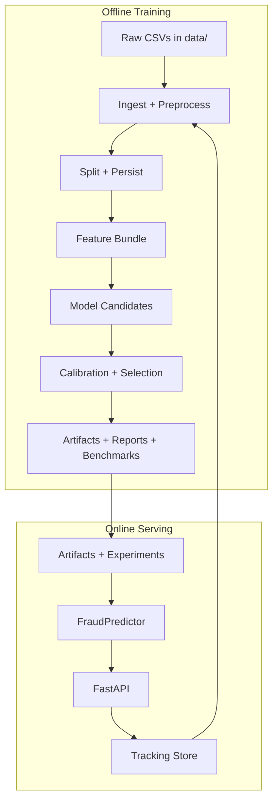
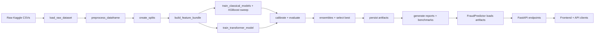
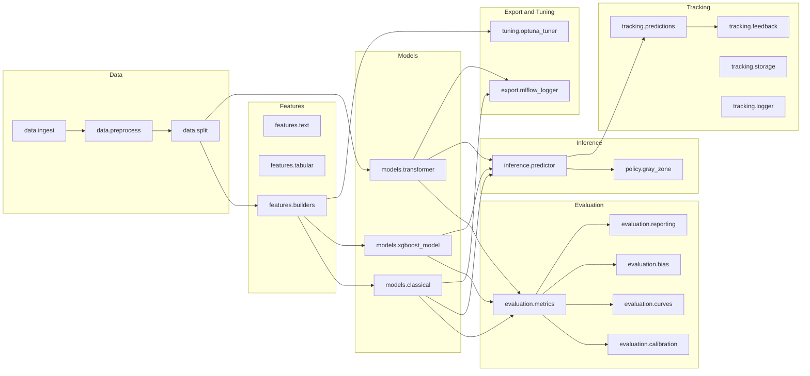
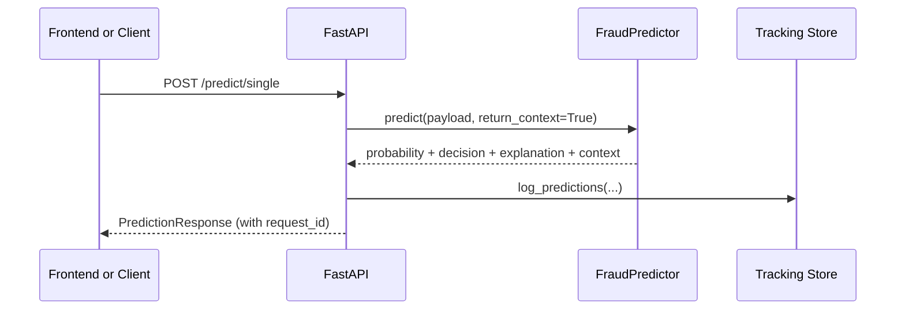

# Spot the Scam - Architecture Overview

This document explains how the repository is put together across training, inference, review workflows, the chat assistant, the frontend dashboard, and deployment scaffolding. It is intentionally grounded in the actual code paths and artifacts in this repo.

## Table of Contents

- [System Context](#system-context)
- [End-to-End Dataflow](#end-to-end-dataflow)
- [Repository Layout and Responsibilities](#repository-layout-and-responsibilities)
- [Python Package Architecture](#python-package-architecture)
- [Training Pipeline Architecture](#training-pipeline-architecture)
- [Artifact Contract (Train → Serve)](#artifact-contract-train--serve)
- [Inference Architecture and Request Lifecycle](#inference-architecture-and-request-lifecycle)
- [Review and Feedback Architecture](#review-and-feedback-architecture)
- [Chat Assistant Architecture](#chat-assistant-architecture)
- [Frontend Architecture (Next.js)](#frontend-architecture-nextjs)
- [Deployment and MLOps Footprint](#deployment-and-mlops-footprint)
- [Extension Points and Safe Customization](#extension-points-and-safe-customization)

## System Context

The system has two loops that share a single artifact contract:

- The offline training loop produces artifacts under `artifacts/` and analysis under `experiments/`.
- The online serving loop loads those artifacts through `FraudPredictor` and exposes them via FastAPI.

## End-to-End Dataflow

The best way to understand the architecture is to follow the actual main training entrypoint and the main serving entrypoint.

### Training entrypoint

- Entrypoint: `src/spot_scam/pipeline/train.py`
- CLI: `PYTHONPATH=src python -m spot_scam.pipeline.train`

### Serving entrypoint

- Entrypoint: `src/spot_scam/api/app.py`
- CLI: `PYTHONPATH=src uvicorn spot_scam.api.app:app --reload`

## Repository Layout and Responsibilities

Top-level structure and the role of each area.

| Path | Responsibility |
|------|----------------|
| `src/spot_scam/` | Core ML, inference runtime, FastAPI, tracking, export, and tuning logic |
| `configs/` | Configuration defaults (`defaults.yaml`) |
| `data/` | Raw datasets and persisted processed splits |
| `artifacts/` | Train-time outputs consumed by inference |
| `experiments/` | Evaluation outputs (figures, tables, reports) |
| `tracking/` | Prediction logs, feedback, and run tracking |
| `frontend/` | Next.js dashboard and chat UI |
| `scripts/` | Helper CLIs (download, tuning, sampling, quick runs) |
| `docs/` | Deep-dive docs (deployment, explainability, optuna, pipeline) |
| `ops/` | Deployment and observability scaffolding (k8s, CI, load tests) |

## Python Package Architecture

The Python package is modular but tightly coordinated by the training pipeline and the inference runtime.

## Training Pipeline Architecture

The training pipeline is a single orchestrator that coordinates the entire ML lifecycle.

### Orchestrator

- File: `src/spot_scam/pipeline/train.py`
- Main function: `run(...)`

### Training stages (actual order)

1. Load config via `config.loader.load_config`.
2. Set global seed and ensure directory structure.
3. Load raw data via `data.ingest.load_raw_dataset`.
4. Preprocess via `data.preprocess.preprocess_dataframe`.
5. Optionally override labels via reviewer feedback.
6. Create splits via `data.split.create_splits(..., persist=True)`.
7. Persist splits to `data/processed/{train,val,test}.parquet`.
8. Build features via `features.builders.build_feature_bundle`.
9. Train classical candidates via `models.classical.train_classical_models`.
10. Generate XGBoost variants via `models.xgboost_model.XGBoostModel`.
11. Evaluate classical candidates on the test set.
12. Optionally train a transformer via `models.transformer.train_transformer_model`.
13. Build ensemble candidates over top TF-IDF+tabular models.
14. Select the best validation performer.
15. Persist artifacts and metadata.
16. Generate figures, tables, and the markdown report.
17. Benchmark inference latency and throughput.
18. Append run records to `tracking/runs.csv`.
19. Attempt MLflow and ONNX export.

### Design implications

This architecture makes the pipeline:

- Deterministic given the same config and artifacts directory state.
- Reproducible by persisting both splits and a full config snapshot.
- Operationally grounded by benchmarking the actual inference runtime.

## Artifact Contract (Train → Serve)

`FraudPredictor` is the contract boundary. It expects a specific set of files produced by training.

### Required artifacts

| Artifact | Why it exists |
|---------|----------------|
| `artifacts/metadata.json` | Source of truth for model identity, thresholds, and policy |
| `artifacts/config_used.yaml` | Ensures inference preprocessing matches training |
| `artifacts/model.joblib` | Calibrated model used in production scoring |
| `artifacts/features/tfidf_vectorizer.joblib` | TF-IDF vocabulary and weights |
| `artifacts/features/tabular_scaler.joblib` | Tabular feature scaling parameters |
| `artifacts/features/tabular_feature_names.joblib` | Feature alignment safety checks |

### Optional artifacts with first-class support

- `artifacts/base_model.joblib` for richer linear explanations.
- `artifacts/transformer/` for transformer inference.
- `experiments/tables/*.csv` for insights endpoints.
- `artifacts/transformer/quantized/model.pt` when using quantized transformer inference.

## Inference Architecture and Request Lifecycle

Inference is handled by `src/spot_scam/inference/predictor.py` and exposed through `src/spot_scam/api/app.py`.

### Predictor responsibilities

`FraudPredictor`:

- Loads metadata and config snapshots.
- Restores classical or transformer artifacts.
- Re-runs preprocessing using the train-time config.
- Builds feature matrices (TF-IDF and tabular).
- Produces calibrated probabilities.
- Applies the gray-zone decision policy.
- Builds explanations for both classical and transformer variants.
- Serves insights derived from `experiments/tables/`.

### Request lifecycle for `/predict/single`

### Decision policy

The gray-zone policy is implemented in `policy/gray_zone.py` and applied to every prediction via `apply_gray_zone(...)`.

## Review and Feedback Architecture

The review loop is not a side feature. It is integrated into both inference and training.

### Prediction logging

- Module: `tracking/predictions.py`
- Storage: `tracking/predictions/date=*/part-*.parquet`

Each logged record includes:

- A generated `request_id`
- Masked/sanitized payload text
- Hashes of processed text and tabular features
- Probability, decision, and model version
- Explanation and meta blocks

### Feedback logging

- Module: `tracking/feedback.py`
- Storage: `tracking/feedback/date=*/part-*.parquet`

Feedback is lightly sanitized using regex-based email and phone masking.

### Queue assembly

The `/cases` endpoint uses:

- Gray-zone filtering around the active threshold, or
- Entropy-based uncertainty sampling

It excludes already-reviewed cases and can optionally merge an “active sample” CSV for curated triage.

### Feedback integration into training

When `USE_FEEDBACK=1` (or `--use-feedback`), the training pipeline:

- Loads reviewer feedback
- Overrides labels by matching on `text_hash`
- Emits additional delta tables for analysis

## Chat Assistant Architecture

The `/chat` endpoint is an agentic routing layer that blends LLM judgment with the trained fraud model.

### Routing behavior

1. A Gemini classifier prompt attempts to label the message as a job posting.
2. If it looks like a job post and no explicit context is provided, the backend auto-runs the fraud predictor.
3. The assistant prompt is assembled with:
   - Classification results
   - Fraud prediction outputs
   - Explanations and decision policy context
   - Job posting context from the frontend (when available)
4. Gemini streams the final response via Server-Sent Events (SSE).

### Architectural intent

This keeps the chat assistant useful for general questions while still anchoring job-post analysis in the calibrated ML model.

## Frontend Architecture (Next.js)

The frontend is a Next.js App Router application under `frontend/`.

### Frontend design characteristics

- Clear separation between API types (`frontend/src/lib/api.ts`) and UI components.
- Strong emphasis on readable explanations and triage workflows.
- A backend-status layer that enables demo-mode fallbacks when the API is offline.

### UI-level data dependencies

The frontend depends on:

- Predictions (`/predict`, `/predict/single`)
- Metadata (`/metadata`)
- Insights (`/insights/*`)
- Review queue (`/cases`) and feedback (`/feedback`)
- Chat streaming (`/chat`)

## Deployment and MLOps Footprint

The repo includes more than a local demo footprint.

### Containers

- API Dockerfile at `Dockerfile`
- Frontend Dockerfile at `frontend/Dockerfile`
- Local multi-service stack at `docker-compose.yml`

### MLflow and ONNX

The export layer (`export/mlflow_logger.py`) aims to:

- Convert models to ONNX where supported
- Package preprocessing and policy logic into MLflow pyfunc models
- Maintain serving parity with the API

### Ops scaffolding

The `ops/` directory contains:

- Kubernetes base and overlays (`ops/k8s/`)
- Tekton pipeline example (`ops/ci/tekton-pipeline.yaml`)
- k6 load testing assets (`ops/observability/`)

These are intended as adaptable scaffolding rather than a rigid deployment prescription.

## Extension Points and Safe Customization

The repository is designed to be extended without breaking serving parity.

### Most important extension points

- `configs/defaults.yaml` for safe, declarative behavior changes.
- `features/tabular.py` to add domain signals that remain explainable.
- `models/classical.py` and `models/xgboost_model.py` for new model candidates.
- `pipeline/train.py` for orchestration logic like new evaluation assets.
- `api/schemas.py` when you need to change the public contract intentionally.

### Safety tips

- Treat `artifacts/config_used.yaml` as part of the model contract.
- When changing preprocessing, retrain and regenerate artifacts.
- Keep an eye on `FraudPredictor._validate_classical_artifacts` when adjusting features.

### What to read next

For the practical “how,” see [INSTRUCTIONS.md](INSTRUCTIONS.md). For the “why,” see [TRAINING_ANALYSIS.md](TRAINING_ANALYSIS.md). For the operational lifecycle, see [MLOPS.md](MLOPS.md).

Feel free to reach out via issues or discussions for clarifications or contributions!
