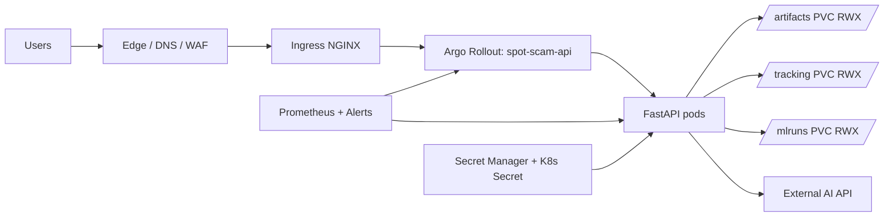
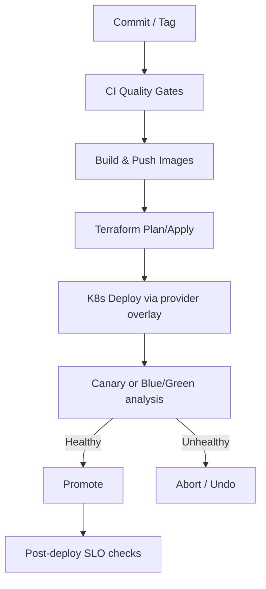
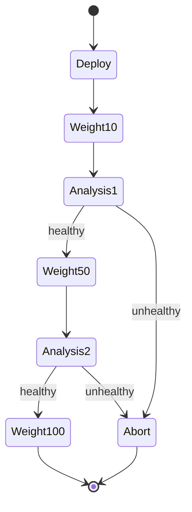
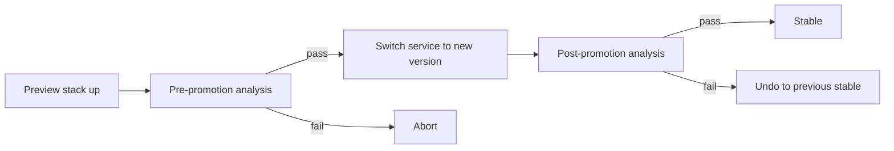
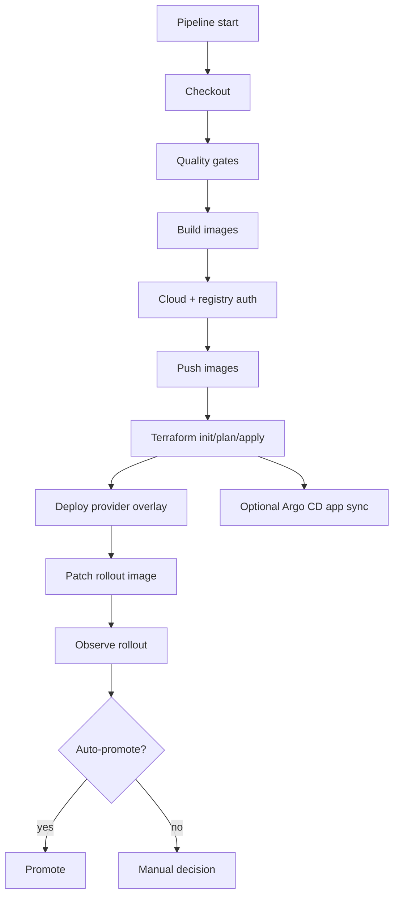

# Spot the Scam Production Deployment Standard

This is the authoritative deployment runbook for Spot the Scam across AWS, Azure, GCP, and OCI.

It is designed for:

- Repeatable environment provisioning with Terraform.
- Progressive API delivery with canary and blue/green rollouts.
- Optional GitOps control plane with Argo CD.
- Provider-neutral release process with provider-specific overlays.
- Production security, observability, and rollback readiness.


## Table of Contents

- [1. Architecture Baseline](#1-architecture-baseline)
- [2. Release Topology](#2-release-topology)
- [3. Repository Deployment Assets](#3-repository-deployment-assets)
- [4. Environment Model](#4-environment-model)
- [5. Prerequisites and Toolchain](#5-prerequisites-and-toolchain)
- [6. Container and Artifact Strategy](#6-container-and-artifact-strategy)
- [7. Terraform Provisioning Standard](#7-terraform-provisioning-standard)
- [8. Kubernetes and Progressive Delivery Standard](#8-kubernetes-and-progressive-delivery-standard)
- [9. CI/CD Standard (Jenkins)](#9-cicd-standard-jenkins)
- [10. Deployment Runbook](#10-deployment-runbook)
- [11. Promotion, Rollback, and Incident Response](#11-promotion-rollback-and-incident-response)
- [12. Security and Compliance Controls](#12-security-and-compliance-controls)
- [13. Observability and SLO Operations](#13-observability-and-slo-operations)
- [14. Disaster Recovery and Backup Policy](#14-disaster-recovery-and-backup-policy)
- [15. Provider-Specific Guides](#15-provider-specific-guides)
- [16. Troubleshooting](#16-troubleshooting)

## 1. Architecture Baseline

Spot the Scam uses a cloud-portable architecture where runtime behavior stays consistent across providers.



Core invariants:

- The API contract remains `spot_scam.api.app:app` on port `8000`.
- Model artifacts are mounted at `/app/artifacts`.
- Tracking/feedback state is persisted at `/app/tracking` and `/app/mlruns`.
- Rollout behavior is controlled by Argo Rollouts resources.

## 2. Release Topology



Release object model:

- Code release: git SHA/tag.
- Image release: immutable image tag and digest.
- Infrastructure release: Terraform plan/apply outcome.
- Runtime release: rollout revision in Kubernetes.

## 3. Repository Deployment Assets

Primary deployment assets in this repository:

- `ops/k8s/base/`: base API runtime manifests.
- `ops/k8s/base/secret-api.example.yaml`: example secret only (not auto-applied).
- `ops/k8s/base/rollout-canary.yaml`: canary strategy baseline.
- `ops/k8s/base/rollout-bluegreen.yaml`: blue/green strategy baseline.
- `ops/argo/`: Argo CD project/application templates and kustomize layers.
- `aws/`, `azure/`, `gcp/`, `oci/`: provider deployment packs.
- `scripts/deploy_multi_cloud.sh`: provider+strategy deploy helper.
- `ops/ci/preflight_deploy_checks.sh`: hard gate for placeholders and required runtime secret.
- `ops/ci/bootstrap_cluster_addons.sh`: installs ingress-nginx and Argo Rollouts controller in-cluster.
- `Jenkinsfile`: production CI/CD pipeline for this deployment model.

## 4. Environment Model

Recommended environment separation:

- `dev`: rapid iteration, reduced scale, canary preferred.
- `staging`: production-like config and load profile, mandatory canary.
- `prod`: strict change controls, canary or blue/green with promotion policy.

Required environment-specific controls:

- Separate cloud accounts/subscriptions/projects/compartments where possible.
- Separate registries/repositories or strict tag policies by environment.
- Separate Kubernetes namespaces and secrets.
- Separate DNS/TLS certificates and WAF policies.

Current repository note:

- Kustomize overlays are currently namespace-pinned to `spot-scam`.

## 5. Prerequisites and Toolchain

Minimum required tooling:

- Docker 24+
- Terraform 1.8+
- kubectl 1.29+
- kustomize 5+
- helm 3.14+
- argo-rollouts CLI
- argocd CLI (for GitOps sync/wait operations)
- Provider CLI (`aws`, `az`, `gcloud`, `oci`)

Production operator access requirements:

- IAM/RBAC rights for infrastructure plan/apply.
- Kubernetes rights for rollout promotion/abort.
- Registry push and pull rights.
- Secret manager read rights (runtime only for workloads).

## 6. Container and Artifact Strategy

Images used by this repository:

- API image: built from `Dockerfile`.
- Frontend image: built from `frontend/Dockerfile`.
- Optional model utility image: built from `docker/model/Dockerfile`.

Production recommendations:

- Promote immutable tags (`release-YYYYMMDD-HHMM-<sha>`).
- Record image digests in release notes/change ticket.
- Enforce image vulnerability scanning for HIGH/CRITICAL gates.
- Keep previous known-good image set available for rollback.

## 7. Terraform Provisioning Standard

For each provider:

1. Initialize Terraform.
2. Validate and plan.
3. Require manual approval (or pipeline approval gate) for production applies.
4. Apply and export kubeconfig command from outputs.
5. Store state in remote backend with locking and encryption.

Production Terraform controls:

- Mandatory remote backend (`S3+DynamoDB`, `AzureRM`, `GCS`, `OCI Object Storage` backend).
- State encryption at rest.
- Restricted state access via IAM.
- Plan file retained as deployment evidence.

## 8. Kubernetes and Progressive Delivery Standard

Kubernetes rollout strategies in this repo:

- Canary: `ops/k8s/base/rollout-canary.yaml`.
- Blue/green: `ops/k8s/base/rollout-bluegreen.yaml`.

Provider overlays patch:

- Registry image path/tag defaults.
- Ingress hostnames/TLS targets.
- Provider-specific RWX storage class names.
- CORS/MLflow runtime defaults by environment/provider.

Canary behavior model:



Blue/green behavior model:



## 9. CI/CD Standard (Jenkins)

This repo includes a production Jenkins pipeline:

- `Jenkinsfile` in repository root.
- `ops/ci/jenkins/README.md` for credential and agent requirements.

Pipeline capabilities:

- Parameterized provider (`aws|azure|gcp|oci`).
- Parameterized rollout strategy (`canary|bluegreen`).
- Quality gates for Python and frontend.
- Container build/push.
- Optional Terraform apply.
- Deployment through `scripts/deploy_multi_cloud.sh`.
- Rollout control actions (`deploy`, `promote`, `abort`, `undo`).
- Optional Argo CD app sync action (`argocd_sync`).
- Deployment asset validation through `ops/ci/validate_deployment_assets.sh`.

Pipeline safety guards:

- Deploys without build/push require explicit `IMAGE_TAG`.
- `KUBECONFIG_COMMAND` supports deploys where Terraform apply is intentionally skipped.
- Preflight checks block deploys with placeholder domains/values and missing runtime secrets.
- Argo CD app examples are templates; bootstrap script requires explicit repo URL and revision.

Pipeline model:



## 10. Deployment Runbook

### Step 1: Provision cloud infrastructure

Use provider Terraform stack:

```bash
cd <provider>/terraform
terraform init
terraform validate
terraform plan -out tfplan
terraform apply tfplan
```

### Step 2: Configure cluster access

```bash
terraform output -raw configure_kubectl
# execute the printed command
kubectl get nodes
```

### Step 3: Bootstrap required cluster add-ons

```bash
# from repository root
./ops/ci/bootstrap_cluster_addons.sh

kubectl get crd rollouts.argoproj.io
```

This will get the cluster ready with an ingress controller and Argo Rollouts controller, which are required for the deployment manifests in this repository to work correctly.

### Step 4: Build and push release images

```bash
docker build -t <API_IMAGE_REPO>:<TAG> .
docker build -t <FRONTEND_IMAGE_REPO>:<TAG> -f frontend/Dockerfile frontend

docker push <API_IMAGE_REPO>:<TAG>
docker push <FRONTEND_IMAGE_REPO>:<TAG>
```

### Step 5: Create runtime secret (required)

`spot-scam-api-secrets` is intentionally not auto-applied from kustomize. Create it before deploy:

```bash
kubectl -n spot-scam create secret generic spot-scam-api-secrets \
  --from-literal=GEMINI_API_KEY='<real-key>' \
  --dry-run=client -o yaml | kubectl apply -f -
```

### Step 6: Deploy selected provider/strategy

```bash
./scripts/deploy_multi_cloud.sh \
  --provider <aws|azure|gcp|oci> \
  --strategy <canary|bluegreen> \
  --namespace spot-scam
```

### Step 7: Patch release image and watch rollout

```bash
kubectl -n spot-scam patch rollout spot-scam-api \
  --type='merge' \
  -p '{"spec":{"template":{"spec":{"containers":[{"name":"api","image":"<API_IMAGE_REPO>:<TAG>"}]}}}}'

argo-rollouts get rollout spot-scam-api -n spot-scam
```

### Optional: Argo CD GitOps bootstrap and sync

```bash
./ops/ci/bootstrap_argocd.sh \
  --env staging \
  --provider aws \
  --repo-url https://github.com/<org>/<repo>.git \
  --revision main

./ops/ci/argocd_sync_wait.sh --app spot-scam-staging-aws --timeout-sec 900
```

## 11. Promotion, Rollback, and Incident Response

Promotion/rollback commands:

```bash
argo-rollouts promote spot-scam-api -n spot-scam
argo-rollouts abort spot-scam-api -n spot-scam
argo-rollouts undo spot-scam-api -n spot-scam
```

Incident response baseline:

1. Freeze further deployments.
2. Abort active rollout if error budget breach continues.
3. Roll back to previous stable revision.
4. Capture timeline (alert time, promote/abort time, rollback time).
5. Open post-incident review with action items.

## 12. Security and Compliance Controls

Mandatory controls:

- Secrets never stored in git; inject via secret managers and CI credentials.
- TLS on all public ingress endpoints.
- Container image scanning before promotion.
- Least privilege IAM for CI identities and workloads.
- Audit logging enabled for cloud and Kubernetes control planes.
- NetworkPolicy enforcement in-cluster.

Recommended advanced controls:

- OPA/Gatekeeper or Kyverno policy enforcement.
- Signed images and provenance (Sigstore/Cosign).
- Runtime threat detection (Falco or provider equivalent).

## 13. Observability and SLO Operations

Operational metrics and indicators:

- API error rate (5xx) and latency (p95/p99).
- Rollout analysis success/failure rate.
- Pod restart count and OOM events.
- Queue size and feedback ingestion success for review workflows.

Minimum deployment checks:

```bash
kubectl get pods -n spot-scam
kubectl get svc,ingress -n spot-scam
kubectl get pvc -n spot-scam
kubectl describe rollout spot-scam-api -n spot-scam
```

## 14. Disaster Recovery and Backup Policy

Backup requirements:

- Persist and back up `/app/artifacts`.
- Persist and back up `/app/tracking` and `/app/mlruns`.
- Backup Terraform state and lock metadata.
- Archive release manifests and image digests per deployment.

Recovery objectives:

- Define and document RTO/RPO per environment.
- Test restore process quarterly.
- Keep runbook for full cluster+data restoration.

## 15. Provider-Specific Guides

- AWS: [`aws/README.md`](aws/README.md)
- Azure: [`azure/README.md`](azure/README.md)
- GCP: [`gcp/README.md`](gcp/README.md)
- OCI: [`oci/README.md`](oci/README.md)
- Argo CD assets: [`ops/argo/README.md`](ops/argo/README.md)

## 16. Troubleshooting

### Rollout stuck in paused state

- Check Argo Rollouts analysis status and failed metrics.
- Promote manually only after verifying SLOs.

### PVC provisioning failure

- Verify provider storage class exists.
- Confirm CSI driver installation and cloud storage permissions.

### Pods crash on startup

- Check `/health` endpoint path and startup logs.
- Confirm mounted artifacts exist and are readable.
- Validate secret values (for example `GEMINI_API_KEY`).

### Ingress not serving traffic

- Confirm DNS records and TLS secret are correct.
- Validate ingress controller service has external address.

### Terraform apply drift issues

- Run `terraform refresh` and re-plan.
- Validate manual changes were not made outside Terraform.
