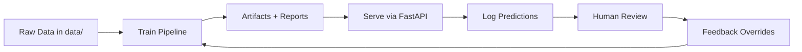
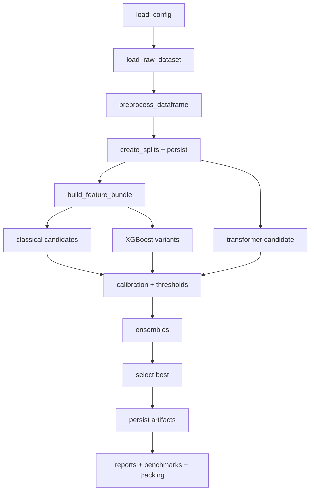
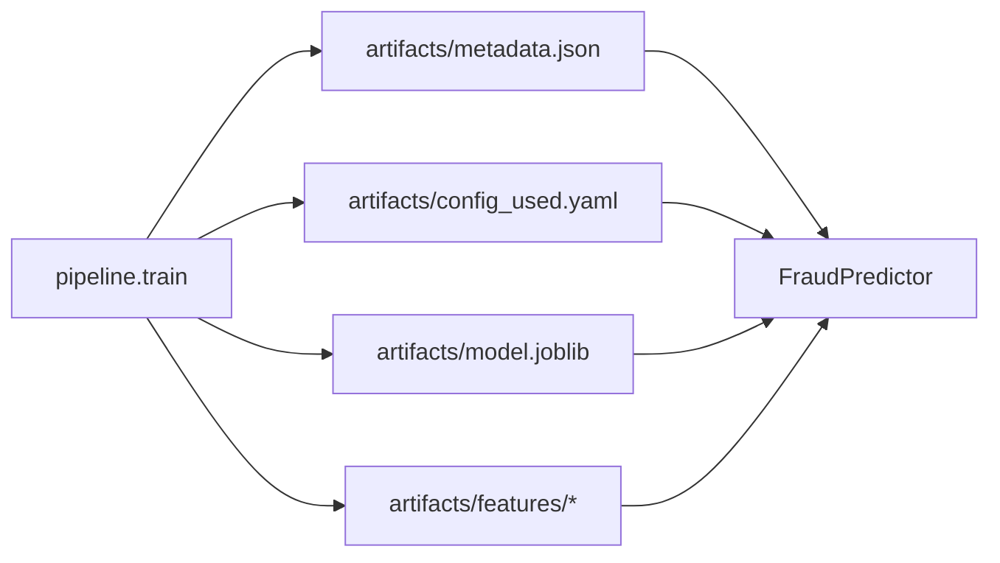
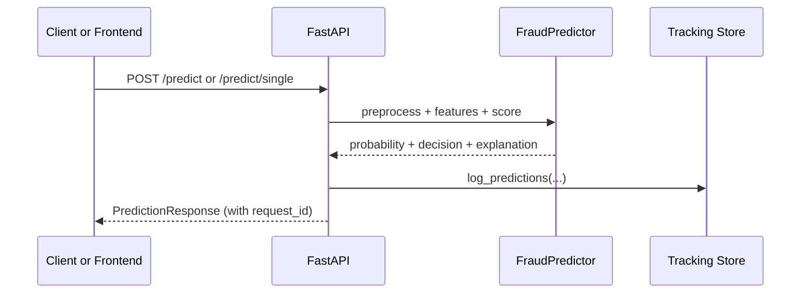
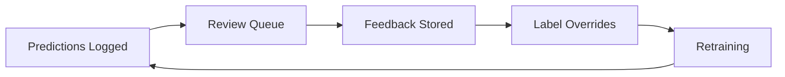
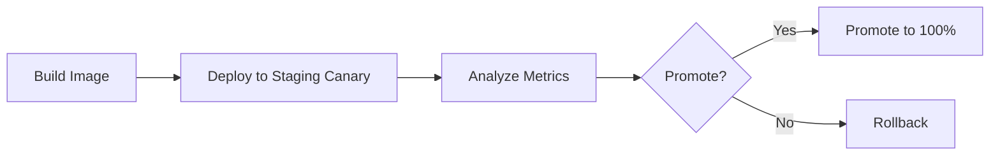
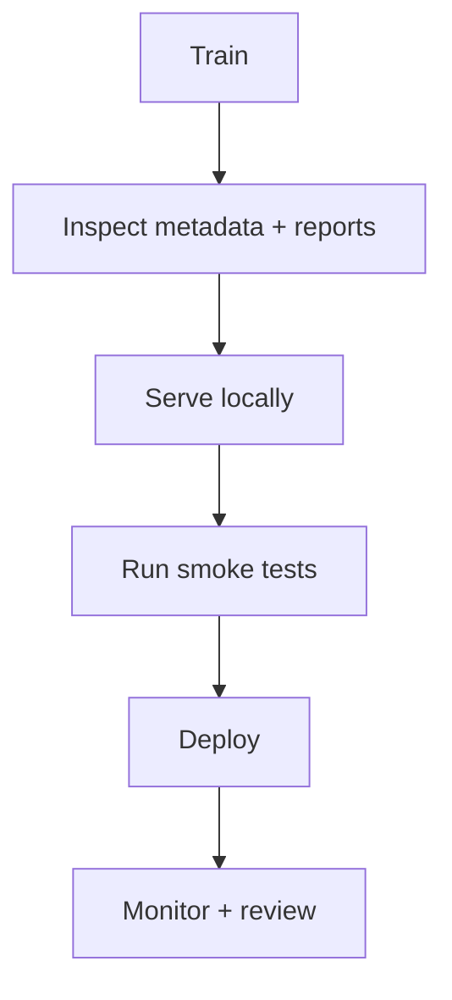

# MLOps Guide - Spot the Scam

This document describes the end-to-end MLOps system for Spot the Scam: how models are trained, packaged, validated, served, monitored, and improved through feedback. It is grounded in the actual artifact contract, code paths, and ops scaffolding in this repository.

## Table of Contents

- [MLOps Overview](#mlops-overview)
- [Lifecycle at a Glance](#lifecycle-at-a-glance)
- [Training Pipeline (System of Record)](#training-pipeline-system-of-record)
- [Artifact Contract and Lineage](#artifact-contract-and-lineage)
- [Packaging and Export Surfaces](#packaging-and-export-surfaces)
- [Serving Architecture and Parity Guarantees](#serving-architecture-and-parity-guarantees)
- [Prediction Logging, Review, and Feedback](#prediction-logging-review-and-feedback)
- [Evaluation, Reporting, and Release Gates](#evaluation-reporting-and-release-gates)
- [CI/CD and Progressive Delivery Scaffolding](#cicd-and-progressive-delivery-scaffolding)
- [Monitoring, Alerts, and Operational Signals](#monitoring-alerts-and-operational-signals)
- [Runbooks and Operational Workflows](#runbooks-and-operational-workflows)
- [Security, Privacy, and Governance Notes](#security-privacy-and-governance-notes)
- [MLOps Checklist](#mlops-checklist)
- [Where Things Live (Quick Index)](#where-things-live-quick-index)

## MLOps Overview

Spot the Scam is built around a strong train-serve contract. The training pipeline produces explicit artifacts, and the serving runtime (`FraudPredictor`) validates those artifacts before responding to requests.

Key design traits:

- Artifact-first workflows under `artifacts/`, `experiments/`, and `tracking/`.
- Reproducibility via config snapshots and persisted splits.
- Operational safety via calibration, thresholding, and gray-zone routing.
- Human feedback as a first-class retraining input.

## Lifecycle at a Glance



## Training Pipeline (System of Record)

The training orchestrator is the system of record for model state.

- Entrypoint: `src/spot_scam/pipeline/train.py`
- Typical commands:
  - `make train`
  - `make train-fast`
  - `make retrain-with-feedback`

### Training stages



### Reproducibility mechanisms

- Config snapshot: `artifacts/config_used.yaml`
- Config hash in tracking: `tracking/runs.csv`
- Persisted splits:
  - `data/processed/split_indices.npz`
  - `data/processed/train.parquet`, `val.parquet`, `test.parquet`

## Artifact Contract and Lineage

Serving relies on a strict artifact contract produced by training.



### Core contract files

Required for classical serving:

- `artifacts/metadata.json`
- `artifacts/config_used.yaml`
- `artifacts/model.joblib`
- `artifacts/features/tfidf_vectorizer.joblib`
- `artifacts/features/tabular_scaler.joblib`
- `artifacts/features/tabular_feature_names.joblib`

Serving-time safety check:

- `FraudPredictor._validate_classical_artifacts` compares expected feature dimensions to estimator dimensions and fails fast on mismatch.

## Packaging and Export Surfaces

The repo supports multiple packaging surfaces beyond raw joblib artifacts.

### MLflow and ONNX export

Export is implemented in `src/spot_scam/export/mlflow_logger.py` and invoked from the training pipeline.

Key behaviors:

- MLflow export can be toggled via `configs/defaults.yaml`.
- ONNX export is supported for certain classical estimators (e.g., logistic regression, linear SVM).
- Dynamic quantization to INT8 ONNX is attempted when enabled.
- Preprocessing assets (vectorizer, scaler, feature names) and policy metadata are packaged alongside the ONNX graph.

Export guardrail:

- Ensembles are intentionally skipped for ONNX export.

## Serving Architecture and Parity Guarantees

Serving is designed to mirror training-time preprocessing and policy logic.

- API: `src/spot_scam/api/app.py`
- Runtime: `src/spot_scam/inference/predictor.py`
- Schemas: `src/spot_scam/api/schemas.py`

### Prediction request lifecycle



Parity is preserved because the predictor:

- Loads `artifacts/config_used.yaml` and reuses the same preprocessing configuration.
- Validates feature dimensionality against the trained model.

## Prediction Logging, Review, and Feedback

Prediction logging and feedback are built into the serving layer.

### Prediction logging

- Module: `src/spot_scam/tracking/predictions.py`
- Storage: `tracking/predictions/date=*/part-*.parquet`
- Includes: request IDs, model version, probability, decision, hashes, sanitized payloads, and explanations.

### Feedback logging

- Module: `src/spot_scam/tracking/feedback.py`
- Storage: `tracking/feedback/date=*/part-*.parquet`
- Notes: rationale/notes fields are lightly masked for PII (email/phone patterns).

### Review queue

- Endpoint: `GET /cases`
- Policies: gray-zone and entropy sampling
- Optional sampler: `scripts/sample_uncertain.py`

### Feedback-to-training loop



To train with overrides:

```bash
make retrain-with-feedback
```

## Evaluation, Reporting, and Release Gates

The training pipeline writes both diagnostics and operational assets.

### Artifacts used as release gates

- `artifacts/metadata.json`
- `experiments/tables/metrics_summary.csv`
- `experiments/figs/calibration_curve_test.png`
- `experiments/tables/slice_metrics.csv`
- `experiments/tables/benchmark_summary.csv`

### Reporting surfaces

- Markdown summary: `experiments/report.md`
- Figures: `experiments/figs/*`
- Tables: `experiments/tables/*`

## CI/CD and Progressive Delivery Scaffolding

The repo includes scaffolding for progressive delivery and CI/CD.

### Kubernetes progressive delivery

- Base and overlays: `ops/k8s/`
- Overlays:
  - Staging canary: `ops/k8s/overlays/staging-canary/`
  - Production blue/green: `ops/k8s/overlays/prod-bluegreen/`

### Progressive delivery concept flow



### CI/CD example

- Tekton pipeline: `ops/ci/tekton-pipeline.yaml`

### Load testing hooks

- k6 smoke script: `ops/observability/k6-smoke.js`
- Helper: `scripts/loadtest_k6.sh`

## Monitoring, Alerts, and Operational Signals

Operational signals are already available from artifacts, tracking, and insights endpoints.

### Offline signals (from training outputs)

- Calibration quality: `experiments/figs/calibration_curve_test.png`
- Slice performance: `experiments/tables/slice_metrics.csv`
- Latency/throughput: `experiments/tables/benchmark_summary.csv`
- Drift heuristics: token frequency deltas in `experiments/tables/token_frequency_analysis.csv`

### Online signals (from serving and tracking)

- Prediction volume and decision mix: `tracking/predictions/`
- Review load and feedback rates: `tracking/feedback/`
- Insights endpoints:
  - `/insights/latency`
  - `/insights/slice-metrics`
  - `/insights/threshold-metrics`
  - `/insights/token-importance`
  - `/insights/token-frequency`

## Runbooks and Operational Workflows

### Standard release runbook



### Minimal commands

Train (fast classical pass):

```bash
make train-fast
```

Serve:

```bash
make serve
```

Sample uncertain cases:

```bash
make review-sample
```

## Security, Privacy, and Governance Notes

This project handles user-submitted text and potentially sensitive job content.

- Avoid logging raw payloads outside the controlled tracking store unless necessary.
- Review third-party LLM usage carefully for `/chat`.
- Treat tracking data retention and export rules as part of governance, not just engineering.

## MLOps Checklist

A practical checklist that maps to this repository.

### Training and artifact hygiene

- Run training from the orchestrator (`pipeline/train.py`).
- Confirm the winner and thresholds in `artifacts/metadata.json`.
- Ensure `artifacts/config_used.yaml` exists and reflects the intended config.

### Serving parity

- Start the API and check `GET /health`.
- Validate that predictions include explanations and gray-zone metadata.
- Watch for fast-fail errors from artifact dimension mismatch.

### Release gates

- Check calibration and slice metrics.
- Check latency benchmarks.
- Confirm decision routing volume is acceptable (fraud vs legit vs review).

### Feedback loop

- Ensure predictions are logged.
- Ensure review flows are working.
- Use `make retrain-with-feedback` when reviewer corrections accumulate.

## Where Things Live (Quick Index)

### Core MLOps code paths

- Training orchestrator: `src/spot_scam/pipeline/train.py`
- Inference runtime: `src/spot_scam/inference/predictor.py`
- API surface: `src/spot_scam/api/app.py`
- Contracts: `src/spot_scam/api/schemas.py`
- Export: `src/spot_scam/export/mlflow_logger.py`
- Tracking:
  - `src/spot_scam/tracking/predictions.py`
  - `src/spot_scam/tracking/feedback.py`
  - `src/spot_scam/tracking/storage.py`
  - `src/spot_scam/tracking/logger.py`

### Core MLOps data surfaces

- Artifacts: `artifacts/`
- Experiments: `experiments/`
- Tracking: `tracking/`
- Ops scaffolding: `ops/`
- Config: `configs/defaults.yaml`

For setup, see [INSTRUCTIONS.md](INSTRUCTIONS.md). For architecture context, see [ARCHITECTURE.md](ARCHITECTURE.md). For results, see [RESULTS.md](RESULTS.md). For training strategy, see [TRAINING_ANALYSIS.md](TRAINING_ANALYSIS.md). For pipeline details, see [docs/pipeline_walkthrough.md](docs/pipeline_walkthrough.md). For deployment guidance, see [docs/deployment_guide.md](docs/deployment_guide.md). For explainability details, see [docs/explainability.md](docs/explainability.md).
