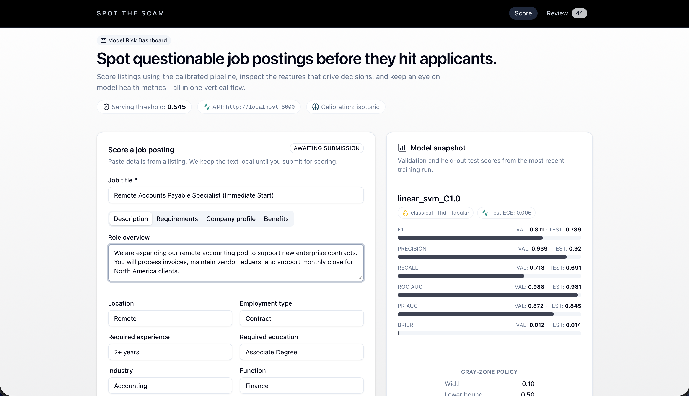
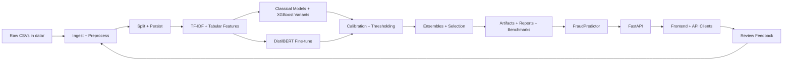
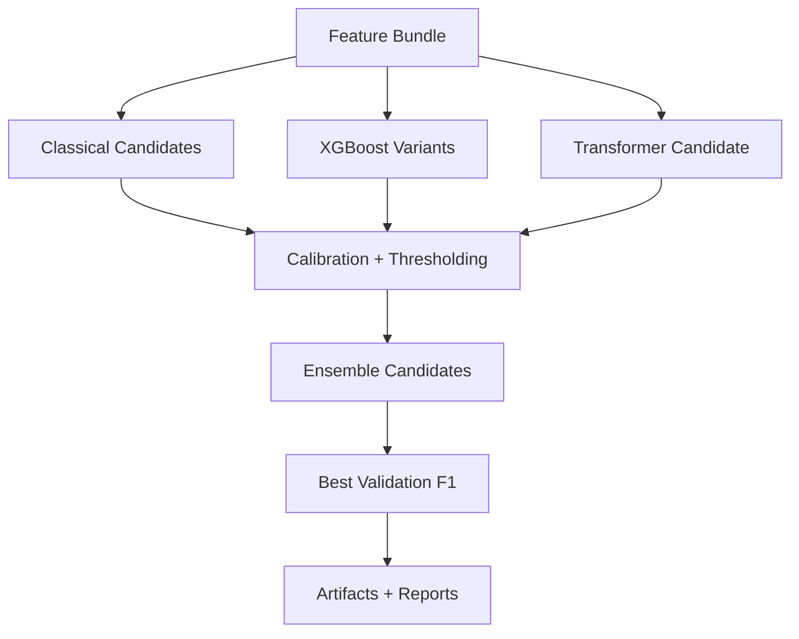
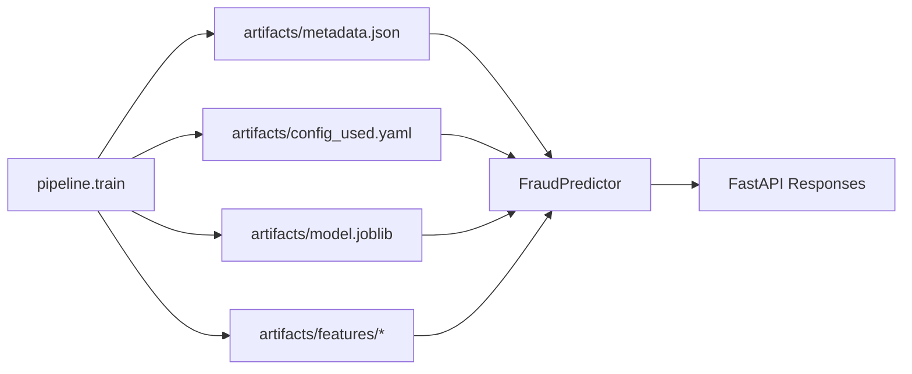
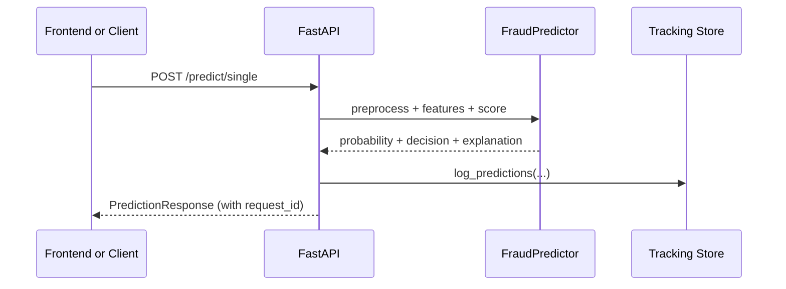

# Spot the Scam - AI Job Fraud Detection


Spot the Scam is a full-stack, uncertainty-aware fraud detector for job postings. It combines calibrated classical ML, optional transformer fine-tuning, explainable outputs, and a human-in-the-loop review queue so teams can act fast with confidence.

<p align="center">
  
</p>

## Table of Contents

- [Executive Overview](#executive-overview)
- [Design Goals and Principles](#design-goals-and-principles)
- [Current Model Snapshot (Repo-Grounded)](#current-model-snapshot-repo-grounded)
- [End-to-End System Flow](#end-to-end-system-flow)
- [Quickstart](#quickstart)
- [Common Workflows](#common-workflows)
- [Data Sources, Fields, and Footprint](#data-sources-fields-and-footprint)
- [Feature Engineering and Signals](#feature-engineering-and-signals)
- [Model Stack, Calibration, and Decision Policy](#model-stack-calibration-and-decision-policy)
- [Artifacts, Reports, and Tracking](#artifacts-reports-and-tracking)
- [API Surface and Contracts](#api-surface-and-contracts)
- [Frontend Experience (Next.js)](#frontend-experience-nextjs)
- [AI Chat Assistant Routing](#ai-chat-assistant-routing)
- [MLOps, Packaging, and Deployment Surfaces](#mlops-packaging-and-deployment-surfaces)
- [Multi-Cloud Deployment Packs](#multi-cloud-deployment-packs)
- [Reproducibility and Experiment Hygiene](#reproducibility-and-experiment-hygiene)
- [Repository Map](#repository-map)
- [Documentation Map](#documentation-map)
- [Limitations and Responsible Use](#limitations-and-responsible-use)
- [FAQ](#faq)
- [License and Citation](#license-and-citation)

## Executive Overview

This repository is not just a model. It is a complete fraud-detection system with:

- Offline training produces a clear artifact contract under `artifacts/`.
- Online serving loads those artifacts through `FraudPredictor`.
- A FastAPI service exposes predictions, insights, review queues, and chat.
- A Next.js dashboard provides scoring, review, and AI-assisted analysis.
- A review loop logs predictions, captures feedback, and supports retraining with overrides.

## Design Goals and Principles

The architecture reflects operational realities of trust and safety workflows:

- Precision-first defaults so alerts are actionable.
- Calibration as a first-class requirement so probabilities are trustworthy.
- A gray-zone policy so ambiguous cases route to review, not guesswork.
- Explainability on every prediction so decisions are auditable.
- Artifact-driven serving to avoid train/serve drift.

## Current Model Snapshot (Repo-Grounded)

All values below are derived directly from the checked-in artifact set, especially `artifacts/metadata.json` and `artifacts/test_predictions.csv`.

### Winner identity

- Model: `ensemble_top3`
- Model type: `classical`
- Feature type: `tfidf+tabular`
- Decision threshold: `0.5802`
- Gray-zone width: `0.10`
- Test calibration error (ECE): `0.0066`

### Metrics summary

| Split | F1 | Precision | Recall | ROC-AUC | PR-AUC | Brier |
|------|----:|----------:|-------:|--------:|-------:|------:|
| Validation | 0.8561 | 0.9297 | 0.7933 | 0.9890 | 0.9053 | 0.0103 |
| Test | 0.7721 | 0.8537 | 0.7047 | 0.9863 | 0.8659 | 0.0143 |

### Test confusion matrix at the selected threshold

Derived from `artifacts/test_predictions.csv` with the artifact threshold:

| | Pred Legit | Pred Fraud |
|---|-----------:|-----------:|
| True Legit | 3156 | 18 |
| True Fraud | 44 | 105 |

### Gray-zone behavior on the test split

Using the current policy and artifacts:

- Test set size: 3,323
- Decisions: 3,200 legit, 118 fraud, 5 review
- Precision on fraud decisions (post gray-zone routing): 105/118 = 0.8898

For deeper results, see `RESULTS.md` and `experiments/report.md`.

## End-to-End System Flow

The system has two tightly coupled loops connected by a stable artifact contract.



## Quickstart

You have two fast paths depending on whether you prefer containers or local development.

### Option A: Docker Compose (fastest end-to-end)

```bash
docker compose build
docker compose up -d
```

- API: `http://localhost:8000`
- Dashboard: `http://localhost:3000`

If artifacts are missing, run training first (locally or in the container).

### Option B: Local development

Backend setup:

```bash
python3 -m venv .venv
source .venv/bin/activate
pip install -e '.[dev]'
```

Train quickly (classical only):

```bash
PYTHONPATH=src python -m spot_scam.pipeline.train --skip-transformer
```

Serve the API:

```bash
PYTHONPATH=src uvicorn spot_scam.api.app:app --host 0.0.0.0 --port 8000 --reload
```

Run the frontend:

```bash
cd frontend
npm install
npm run dev
```

## Common Workflows

The easiest way to navigate the repo is by workflow.

### Workflow 1: Train and evaluate

- Command: `make train` or `make train-fast`
- Entrypoint: `src/spot_scam/pipeline/train.py`
- Outputs: `artifacts/`, `experiments/`, `tracking/runs.csv`

### Workflow 2: Serve and score

- Command: `make serve`
- Entrypoint: `src/spot_scam/api/app.py`
- Runtime: `src/spot_scam/inference/predictor.py`

### Workflow 3: Review and feedback

- Command: `make serve-queue`
- Review endpoints: `/cases` and `/feedback`
- Storage: `tracking/predictions/` and `tracking/feedback/`
- Retrain with overrides: `make retrain-with-feedback`

### Workflow 4: Tune hyperparameters

- Command: `PYTHONPATH=src python scripts/tune_with_optuna.py --model-type logistic --n-trials 20`
- Tuner: `src/spot_scam/tuning/optuna_tuner.py`
- Study DB: `optuna_study.db`

### Minimal API smoke test

```bash
curl -X POST http://localhost:8000/predict/single \
  -H "Content-Type: application/json" \
  -d '{
        "title": "Remote Data Entry Specialist",
        "description": "We are urgently hiring... purchase laptop...",
        "requirements": "Detail oriented..."
      }'
```

## Data Sources, Fields, and Footprint

### Data sources

The pipeline merges two Kaggle-derived datasets included in `data/`:

- `data/fake_job_postings.csv`
- `data/Fake_Real_Job_Posting.csv`

### Observed class balance (raw)

From the primary raw CSV (`data/fake_job_postings.csv`):

- Rows: 17,880
- Fraudulent rows: 866
- Fraud rate: 4.84%

### Fields used in modeling

Key text fields (concatenated into `text_all`):

- `title`
- `company_profile`
- `description`
- `requirements`
- `benefits`

Key structured fields used for signals and missingness flags include:

- `telecommuting`, `has_company_logo`, `has_questions`
- `employment_type`, `required_experience`, `required_education`, `industry`, `function`

### Split persistence for reproducibility

Training persists both indices and full snapshots:

- Indices: `data/processed/split_indices.npz`
- Snapshots: `data/processed/train.parquet`, `val.parquet`, `test.parquet`

## Feature Engineering and Signals

Feature engineering is deliberately simple, auditable, and effective for this domain.

### Text features (TF-IDF)

- Vectorizer: `sklearn.feature_extraction.text.TfidfVectorizer`
- Defaults (from `configs/defaults.yaml`):
  - N-grams: 1-2
  - `min_df`: 3
  - `max_df`: 0.9
  - Sublinear TF: enabled
  - Max vocabulary size: 100,000

### Tabular features (engineered signals)

`src/spot_scam/features/tabular.py` creates signals such as:

- Text length, uppercase ratio, digit count
- Currency, exclamation, question, and URL counts
- Scam-term counters (10 configured terms by default)
- Binary metadata flags
- Missingness flags on key categorical fields

With defaults enabled, the tabular block contains 25 features.

### Feature bundle contract

`src/spot_scam/features/builders.py` returns a `FeatureBundle` that includes:

- TF-IDF matrices for train/val/test
- Tabular matrices for train/val/test
- A fitted `StandardScaler`
- A stable feature-name list used for inference-time validation

## Model Stack, Calibration, and Decision Policy

The training pipeline evaluates multiple model families under a shared decision framework.

### Training pipeline (candidate generation to selection)



### Classical candidates

Implemented in `src/spot_scam/models/classical.py`:

- Logistic Regression (L2)
- Logistic Regression (L1, optional)
- Linear SVM
- LightGBM (tabular-only)

### XGBoost variants

Implemented in `src/spot_scam/models/xgboost_model.py` and orchestrated in `pipeline/train.py`:

- Generates a large candidate grid but caps variants (default cap: 12)
- Persists per-variant artifacts under `artifacts/xgboost_variants/`
- Persists the best XGBoost artifact under `artifacts/xgboost/`

### Transformer candidate (optional)

Implemented in `src/spot_scam/models/transformer.py`:

- Base: `distilbert-base-uncased`
- Max length: 128 tokens
- Epochs: 3 (with early stopping support)
- FP16: enabled where supported (disabled on macOS)

### Calibration

Implemented in `src/spot_scam/evaluation/calibration.py`:

- Platt scaling (`sigmoid`)
- Isotonic regression

Calibration is selected on validation performance (Brier score and ECE).

### Thresholding and gray-zone policy

Implemented in:

- Threshold search: `src/spot_scam/evaluation/metrics.py`
- Policy routing: `src/spot_scam/policy/gray_zone.py`

Thresholds are optimized on validation data. The gray-zone policy then routes ambiguous probabilities to `review`.

### Ensembles and selection

The pipeline can build:

- `ensemble_top3` (uniform mean over top classical models)
- `ensemble_weighted_top3` (coarse weight search when helpful)

The winner is the candidate with the best validation F1.

## Artifacts, Reports, and Tracking

The repo is designed around a stable artifact contract.

### Artifact contract (train to serve)



### Artifacts that power serving

| Location | Purpose |
|------|------|
| `artifacts/metadata.json` | Model identity, metrics, thresholds, policy, extra metadata |
| `artifacts/config_used.yaml` | Frozen preprocessing and training configuration |
| `artifacts/model.joblib` | Calibrated runtime model |
| `artifacts/base_model.joblib` | Uncalibrated base model (when available) |
| `artifacts/features/*` | TF-IDF vectorizer, scaler, and feature names |
| `artifacts/test_predictions.csv` | Held-out predictions with decisions |

`FraudPredictor` will refuse to serve if feature dimensions do not align with the bundled artifacts.

### Experiment outputs

The training pipeline writes diagnostics under `experiments/`:

- Figures: `experiments/figs/*`
- Tables: `experiments/tables/*`
- Summary: `experiments/report.md`

### Tracking outputs

The system logs operational metadata under `tracking/`:

- Model runs: `tracking/runs.csv`
- Predictions: `tracking/predictions/date=*/part-*.parquet`
- Feedback: `tracking/feedback/date=*/part-*.parquet`

## API Surface and Contracts

The backend is a single FastAPI service (`src/spot_scam/api/app.py`) with typed contracts defined in `src/spot_scam/api/schemas.py`.

### Prediction request lifecycle



### Core endpoints

| Endpoint | Purpose |
|------|------|
| `GET /health` | Liveness and basic model info |
| `GET /metadata` | Model metrics, thresholds, and policy |
| `GET /models` | Recent model candidates from tracking |
| `POST /predict` | Batch scoring |
| `POST /predict/single` | Single scoring |
| `GET /insights/token-importance` | Token coefficient insights |
| `GET /insights/token-frequency` | Token frequency deltas |
| `GET /insights/threshold-metrics` | Validation threshold sweep |
| `GET /insights/latency` | Latency summaries from benchmarks |
| `GET /insights/slice-metrics` | Slice-level performance summaries |
| `GET /cases` | Review queue sampling |
| `POST /feedback` | Reviewer feedback ingestion |
| `POST /chat` | Streaming AI assistant with optional auto-scoring |

### Prediction response design

Every prediction includes:

- A calibrated probability
- A binary label at the selected threshold
- A gray-zone-aware decision
- Model metadata
- A structured explanation payload

## Frontend Experience (Next.js)

The frontend lives under `frontend/` and is built with Next.js App Router, Tailwind CSS, and shadcn/ui components.

### Key pages

- `/`: scoring and decision rationale
- `/review`: triage queue and reviewer feedback
- `/chat`: AI-assisted analysis (streaming)

### Offline-friendly behavior

When the backend is unreachable, the frontend can fall back to demo/mock data so the UI remains explorable.

## AI Chat Assistant Routing

The `/chat` endpoint blends LLM routing with the trained fraud model.

High-level behavior:

- A lightweight LLM classifier first checks whether the message looks like a job posting.
- If it looks like a job post and no explicit prediction context is supplied, the backend auto-runs the fraud predictor.
- The assistant prompt is then assembled with classification results, fraud signals, and any provided job context.
- Responses stream back to the frontend via Server-Sent Events (SSE).

## MLOps, Packaging, and Deployment Surfaces

The repo includes multiple deployment and packaging pathways. For the full operational lifecycle, see [MLOPS.md](MLOPS.md).

### Packaging surfaces

- ONNX export for classical and transformer variants
- MLflow pyfunc packaging that preserves preprocessing and gray-zone policy logic
- Transformer quantization via `spot_scam.pipeline.quantize`

### Deployment scaffolding

- Docker and Docker Compose for local stacks
- Kubernetes manifests under `ops/k8s/`
- Argo CD GitOps assets under `ops/argo/`
- CI/CD scaffolding under `ops/ci/`
- Production Jenkins pipeline via `Jenkinsfile` and `ops/ci/jenkins/README.md`
- Deployment asset validation script at `ops/ci/validate_deployment_assets.sh`
- Deployment preflight guard at `ops/ci/preflight_deploy_checks.sh`
- Cluster add-on bootstrap script at `ops/ci/bootstrap_cluster_addons.sh`
- Load testing hooks under `ops/observability/` and `scripts/`

## Multi-Cloud Deployment Packs

Production-ready multi-cloud deployment packs are now included for AWS, Azure, GCP, and OCI.

- Global deployment playbook: [DEPLOYMENT.md](DEPLOYMENT.md)
- AWS pack: [aws/README.md](aws/README.md)
- Azure pack: [azure/README.md](azure/README.md)
- GCP pack: [gcp/README.md](gcp/README.md)
- OCI pack: [oci/README.md](oci/README.md)

Each provider pack includes:

- Terraform infrastructure stack
- Provider-tuned Kubernetes overlays for canary and blue/green rollouts
- Provider-specific deployment runbook

## Reproducibility and Experiment Hygiene

The repository includes several mechanisms to reduce train/serve drift and improve auditability.

- Config snapshots: `artifacts/config_used.yaml`
- Config hashing: `config.loader.config_hash(...)`
- Persisted splits: `data/processed/*.parquet`
- Run logs: `tracking/runs.csv`
- Artifact compatibility checks: `FraudPredictor._validate_classical_artifacts`

## Repository Map

Top-level layout:

| Path | Purpose |
|------|---------|
| `src/spot_scam/` | Core ML pipeline, inference runtime, API, tracking, and export logic |
| `configs/` | YAML defaults and overrides |
| `data/` | Raw CSVs and persisted processed splits |
| `artifacts/` | Trained models, vectorizers, metadata, and exports |
| `experiments/` | Figures, tables, and reports from training runs |
| `tracking/` | Prediction logs, feedback, and run history |
| `scripts/` | Helper CLIs for data, training, tuning, and sampling |
| `frontend/` | Next.js dashboard |
| `docs/` | Deep-dive documentation and guides |
| `ops/` | Deployment, CI/CD, and observability assets |
| `aws/`, `azure/`, `gcp/`, `oci/` | Provider-specific Terraform + Kubernetes deployment packs |
| `DEPLOYMENT.md` | End-to-end production deployment standard across all providers |

## Documentation Map

Start here, then dive deeper as needed:

- [INSTRUCTIONS.md](INSTRUCTIONS.md): end-to-end setup, training, serving, and ops workflows
- [MLOPS.md](MLOPS.md): end-to-end MLOps lifecycle, artifact contract, and operations guide
- [RESULTS.md](RESULTS.md): curated results, diagnostics, and artifact guide
- [ARCHITECTURE.md](ARCHITECTURE.md): module-level system design and data flow
- [TRAINING_ANALYSIS.md](TRAINING_ANALYSIS.md): training strategy, model selection logic, and trade-offs
- [docs/pipeline_walkthrough.md](docs/pipeline_walkthrough.md): step-by-step pipeline narrative
- [docs/explainability.md](docs/explainability.md): interpretability design and outputs
- [docs/deployment_guide.md](docs/deployment_guide.md): deployment checklist and serving options
- [DEPLOYMENT.md](DEPLOYMENT.md): full multi-cloud deployment runbook and ops baseline
- [aws/README.md](aws/README.md), [azure/README.md](azure/README.md), [gcp/README.md](gcp/README.md), [oci/README.md](oci/README.md): provider-specific deployment guides
- [ops/argo/README.md](ops/argo/README.md): Argo CD GitOps bootstrap and sync workflow
- [ops/ci/jenkins/README.md](ops/ci/jenkins/README.md): Jenkins production CI/CD configuration
- [docs/optuna_quickstart.md](docs/optuna_quickstart.md) and [docs/optuna_tuning.md](docs/optuna_tuning.md): Optuna guides
- [docs/DEVOPS_READINESS.md](docs/DEVOPS_READINESS.md): DevOps scaffolding overview
- [DOCKER.md](DOCKER.md): container-focused setup details
- [ADD_MODELS.md](ADD_MODELS.md): how to add new models cleanly

## Limitations and Responsible Use

This system is trained on public data and should be treated as a decision support tool, not a final authority.

- Real-world distributions can drift.
- Performance can vary by region, industry, and posting style.
- Chat assistant behavior depends on third-party LLMs.
- You should review privacy and retention policies before logging user-submitted content.

## FAQ

### Do I need a Gemini API key?

No for scoring, yes for `/chat`. The chat endpoint requires `GEMINI_API_KEY` in `.env`.

### Do I need a GPU?

No for classical models. A GPU helps for transformer fine-tuning and inference.

### Why is there a gray zone?

It is a deliberate product decision. Ambiguous cases should route to review instead of being forced into a hard label.

### Can I skip transformers entirely?

Yes. Use `--skip-transformer` or `make train-fast` for fast iteration.

## License and Citation

- License: MIT License ([LICENSE](LICENSE))
- Citation: [CITATION.cff](CITATION.cff)
