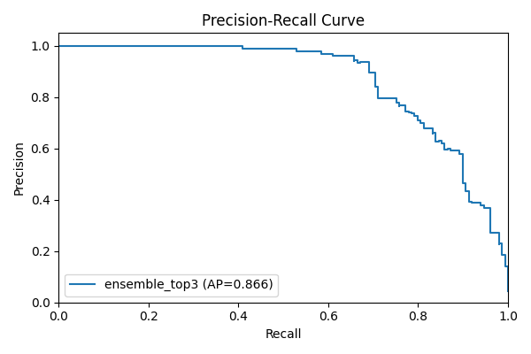
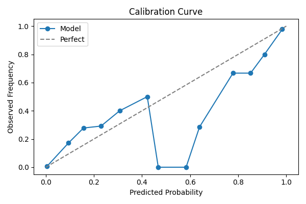
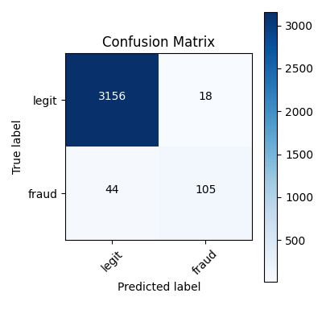
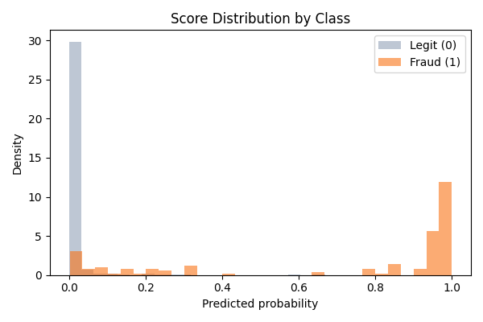
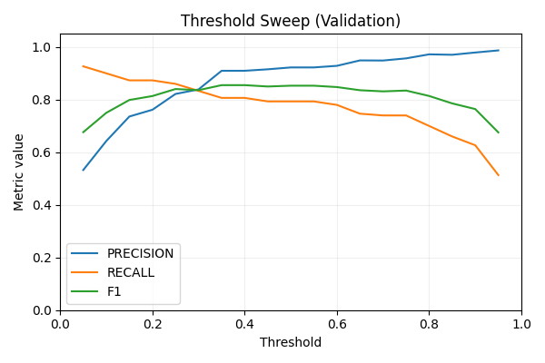
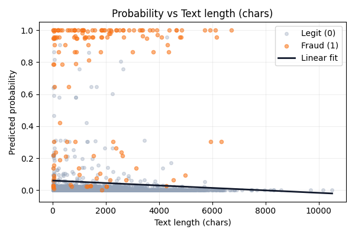
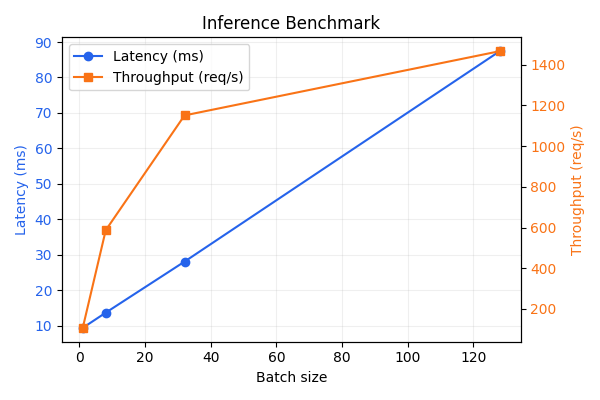

# Results and Diagnostics - Spot the Scam Project

This document summarizes the current repository results, explains how to interpret them, and points to every supporting artifact that the training pipeline generates.

All metrics and thresholds below reflect the artifacts that are already checked into the repository (especially `artifacts/metadata.json`, `artifacts/test_predictions.csv`, and `experiments/`).

## Table of Contents

- [Run Snapshot](#run-snapshot)
- [Metrics Summary](#metrics-summary)
- [Decision Policy and Gray Zone Behavior](#decision-policy-and-gray-zone-behavior)
- [Dataset Footprint (Observed)](#dataset-footprint-observed)
- [Model Composition and What Won](#model-composition-and-what-won)
- [Performance Diagnostics (Plots)](#performance-diagnostics-plots)
- [Explainability and Insight Tables](#explainability-and-insight-tables)
- [Latency and Throughput Benchmarks](#latency-and-throughput-benchmarks)
- [Where Each Result Lives](#where-each-result-lives)
- [How to Reproduce or Refresh Results](#how-to-reproduce-or-refresh-results)
- [Operational Takeaways](#operational-takeaways)

## Run Snapshot

The current best artifact snapshot is:

- Model name: `ensemble_top3`
- Model type: `classical`
- Feature type: `tfidf+tabular`
- Threshold: `0.5802`
- Gray-zone width: `0.10`
- Test ECE: `0.0066`

These values are loaded by the API at runtime via `FraudPredictor` in `src/spot_scam/inference/predictor.py`.

## Metrics Summary

The canonical summary table is generated into `experiments/tables/metrics_summary.csv` and mirrored in `artifacts/metadata.json`.

| Split | F1 | Precision | Recall | ROC-AUC | PR-AUC | Brier |
|------|----:|----------:|-------:|--------:|-------:|------:|
| Validation | 0.8561 | 0.9297 | 0.7933 | 0.9890 | 0.9053 | 0.0103 |
| Test | 0.7721 | 0.8537 | 0.7047 | 0.9863 | 0.8659 | 0.0143 |

Interpretation highlights:

- Precision is intentionally high, aligning with the “actionable alerts” design goal.
- ROC-AUC and PR-AUC indicate strong ranking performance on an imbalanced dataset.
- Brier score and ECE suggest that probabilities are well calibrated.

## Decision Policy and Gray Zone Behavior

The project uses a gray-zone band around the selected threshold to avoid overconfident decisions on ambiguous cases.

### Policy parameters

From `artifacts/metadata.json`:

- Threshold: `0.5802`
- Gray-zone width: `0.10`
- Lower band edge: `0.5302`
- Upper band edge: `0.6302`

### Observed gray-zone behavior on the test set

Using `artifacts/test_predictions.csv`:

- Total test examples: 3,323
- Decisions labeled `fraud`: 118
- Decisions labeled `legit`: 3,200
- Decisions labeled `review`: 5

A notable property of the current artifact set is that the gray zone is extremely narrow in practice (only 5 review cases on the held-out test set). If you want more cases routed to review, increase `gray_zone.width` in `configs/defaults.yaml`.

## Dataset Footprint (Observed)

While the code persists train/validation/test splits to `data/processed/*.parquet`, the repository also provides a direct, observable view of the hold-out test split via `artifacts/test_predictions.csv`.

From that file:

- Test size: 3,323 examples
- Fraudulent labels: 149
- Observed fraud rate: 4.48%

This confirms the imbalanced nature of the task and helps interpret precision/recall trade-offs.

## Model Composition and What Won

The training pipeline (`src/spot_scam/pipeline/train.py`) evaluates a broad classical stack, optional transformer training, and ensembles.

The winning configuration in this repository snapshot is an ensemble across top classical candidates:

- Winner: `ensemble_top3`
- Components (from `artifacts/metadata.json`):
  - `linear_svm_C3.0`
  - `linear_svm_C5.0`
  - `linear_svm_C1.0`

This outcome is consistent with the project’s design priorities: strong, fast, explainable baselines with calibrated outputs and robust thresholding.

## Performance Diagnostics (Plots)

The training run generates a consistent set of figures under `experiments/figs/`.

### Precision-recall curve



### Calibration curve



### Confusion matrix



### Score distribution



### Threshold sweep (validation)



### Probability vs. text length



## Explainability and Insight Tables

The evaluation pipeline produces interpretable artifacts that drive the dashboard’s “insights” sections.

### Core insight tables

- Token coefficients:
  - `experiments/tables/top_terms_positive.csv`
  - `experiments/tables/top_terms_negative.csv`
- Token frequency deltas: `experiments/tables/token_frequency_analysis.csv`
- Slice metrics: `experiments/tables/slice_metrics.csv`
- Threshold sweep points: `experiments/tables/threshold_metrics.csv`
- Probability regression stats: `experiments/tables/probability_regression.csv`

These tables are consumed by `FraudPredictor` methods such as `get_token_importance`, `get_token_frequency`, and `get_slice_metrics`.

## Latency and Throughput Benchmarks

After model selection, the training pipeline runs built-in inference benchmarks and saves both raw and summarized results.

### Summary table

From `experiments/tables/benchmark_summary.csv`:

| Batch Size | Mean Latency (ms) | Mean Throughput (req/s) |
|-----------:|------------------:|-------------------------:|
| 1 | 9.36 | 107.03 |
| 8 | 13.65 | 586.89 |
| 32 | 28.05 | 1150.85 |
| 128 | 87.42 | 1466.38 |

### Benchmark plot



These numbers reflect end-to-end inference through `FraudPredictor.predict`, not just raw estimator calls.

## Where Each Result Lives

This table is meant to be a fast lookup index for both humans and future automation.

| Location | What it contains |
|----------|------------------|
| `artifacts/metadata.json` | Winner name, metrics, threshold, gray-zone policy, and ensemble composition |
| `artifacts/test_predictions.csv` | Test probabilities, labels, and gray-zone decisions |
| `artifacts/config_used.yaml` | Frozen training configuration snapshot |
| `experiments/report.md` | Auto-generated markdown summary of the last training run |
| `experiments/figs/` | Curves, confusion matrix, score distributions, and benchmark plots |
| `experiments/tables/` | Metrics summaries, slices, thresholds, token analytics, and benchmarks |
| `tracking/runs.csv` | Append-only log of model candidates and their results |

## How to Reproduce or Refresh Results

The easiest refresh path is to re-run the training pipeline and let it overwrite artifacts and experiments:

```bash
PYTHONPATH=src python -m spot_scam.pipeline.train --skip-transformer
```

Full training (including transformer):

```bash
PYTHONPATH=src python -m spot_scam.pipeline.train
```

Once training completes, these files will be regenerated:

- `artifacts/*`
- `experiments/figs/*`
- `experiments/tables/*`
- `experiments/report.md`
- `tracking/runs.csv`

## Operational Takeaways

For a real deployment, the most important takeaways from this snapshot are:

- The system is tuned for high precision and calibrated scores.
- The gray zone exists but is currently very narrow in practice.
- The winning model is classical and ensemble-based, which keeps serving fast.
- The repository already includes the artifacts required to run the API and frontend locally.

For deeper reasoning about why these results occur and how to adjust them safely, see [TRAINING_ANALYSIS.md](TRAINING_ANALYSIS.md) and [ARCHITECTURE.md](ARCHITECTURE.md).
