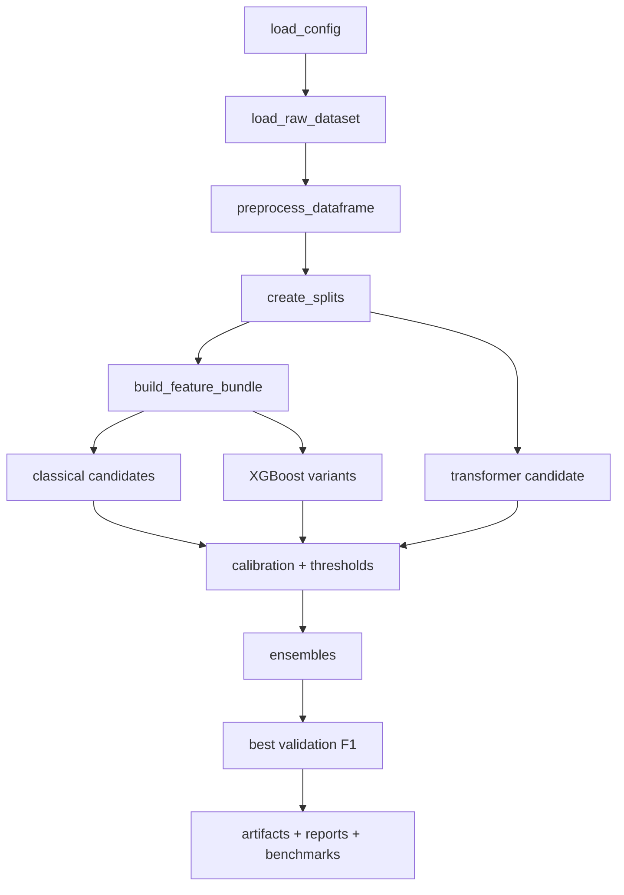
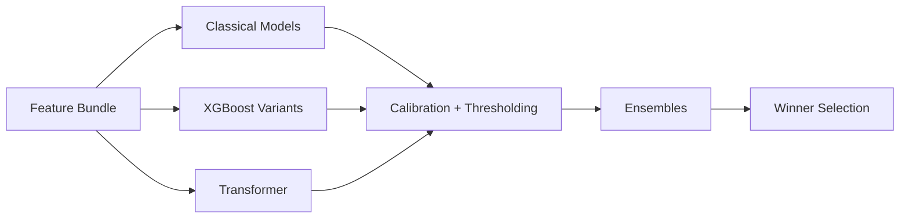
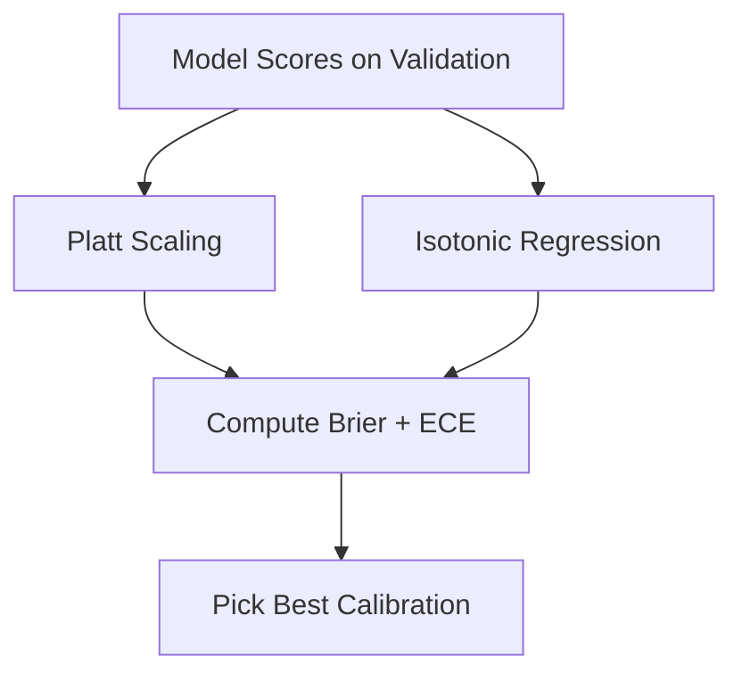
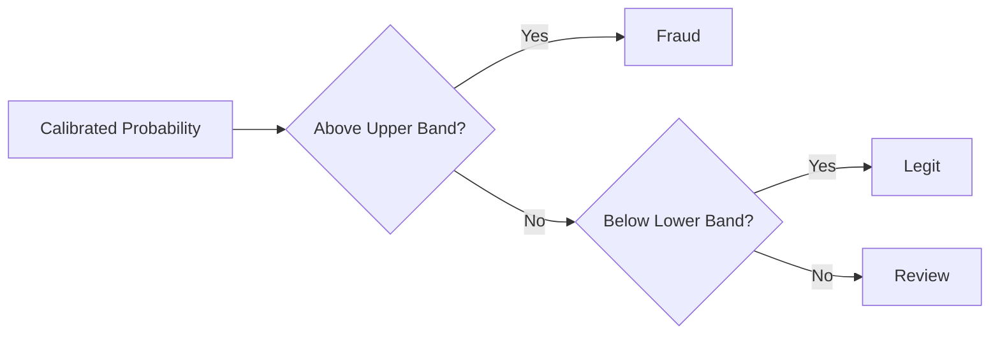
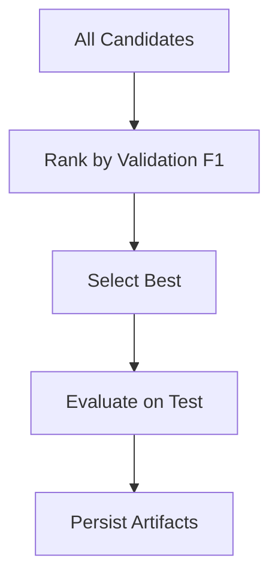
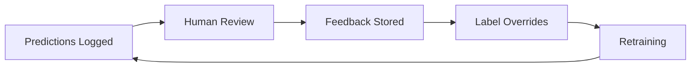
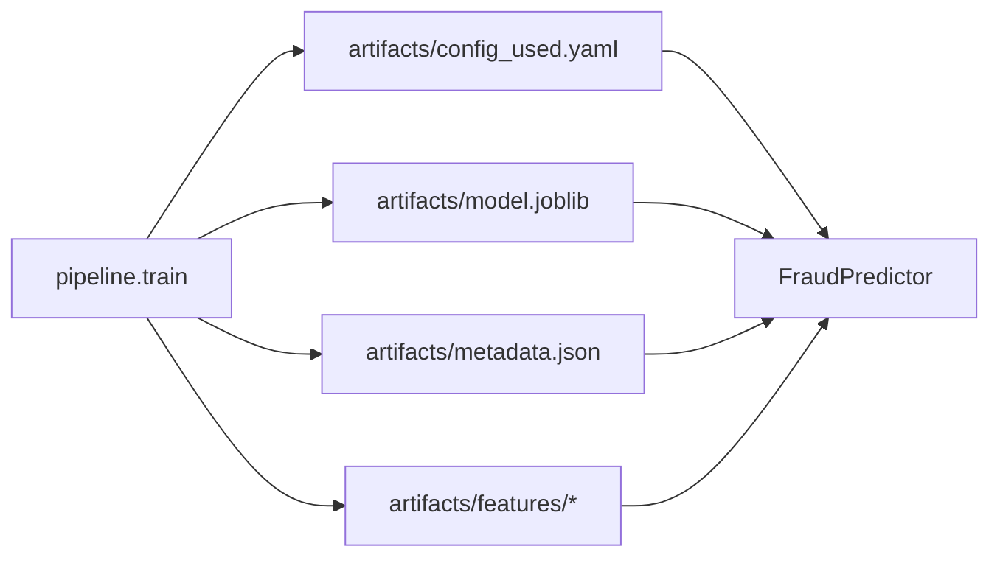

# Training Analysis, Strategy, and Operational Trade-offs - Spot the Scam Project

This document explains how training works in this repository, why it is designed this way, and how to modify it without breaking serving parity. It is grounded in the actual orchestrator (`src/spot_scam/pipeline/train.py`), the default configuration (`configs/defaults.yaml`), and the currently checked-in artifact set under `artifacts/` and `experiments/`.

## Table of Contents

- [Executive Summary](#executive-summary)
- [System-Level Training Goals](#system-level-training-goals)
- [What the Training Orchestrator Actually Does](#what-the-training-orchestrator-actually-does)
- [Data Sources, Balance, and Observed Footprint](#data-sources-balance-and-observed-footprint)
- [Preprocessing Strategy and Leakage Controls](#preprocessing-strategy-and-leakage-controls)
- [Feature Engineering Design](#feature-engineering-design)
- [Model Families and Candidate Generation](#model-families-and-candidate-generation)
- [Calibration and Probability Reliability](#calibration-and-probability-reliability)
- [Threshold Optimization and the Gray Zone](#threshold-optimization-and-the-gray-zone)
- [Ensembles and Winner Selection Logic](#ensembles-and-winner-selection-logic)
- [Results Analysis from the Current Artifact Set](#results-analysis-from-the-current-artifact-set)
- [Evaluation Outputs and How to Read Them](#evaluation-outputs-and-how-to-read-them)
- [Latency and Throughput Benchmarks](#latency-and-throughput-benchmarks)
- [Feedback Integration and Continual Learning Loop](#feedback-integration-and-continual-learning-loop)
- [Artifact Contract and Train-Serve Parity](#artifact-contract-and-train-serve-parity)
- [Reproducibility and Experiment Hygiene](#reproducibility-and-experiment-hygiene)
- [Tuning and Optimization Guidance](#tuning-and-optimization-guidance)
- [Safe Customization Playbook](#safe-customization-playbook)
- [Common Failure Modes and How to Avoid Them](#common-failure-modes-and-how-to-avoid-them)

## Executive Summary

The training system is intentionally engineered for operational reliability rather than novelty. The most important properties are:

- It is configuration-driven and artifact-first.
- It evaluates multiple model families under a shared decision framework.
- It treats calibration, thresholding, and gray-zone routing as first-class design elements.
- It produces the exact artifacts the serving stack expects and validates.
- It supports feedback-driven label overrides via `text_hash` without redesigning the pipeline.

From the current artifact set (`artifacts/metadata.json`):

- Winner: `ensemble_top3`
- Threshold: `0.5802`
- Test metrics: F1 `0.7721`, Precision `0.8537`, Recall `0.7047`, ROC-AUC `0.9863`, PR-AUC `0.8659`, Brier `0.0143`
- Test ECE: `0.0066`

## System-Level Training Goals

The training system is designed to support a very specific product posture:

- Alerts should be trusted, not noisy.
- Probabilities should be meaningful for triage.
- Uncertain cases should be routed to review instead of forced into hard labels.
- Serving should faithfully reproduce training-time behavior.

These goals explain many of the design decisions below.

## What the Training Orchestrator Actually Does

The orchestrator is the `run(...)` function in `src/spot_scam/pipeline/train.py`. It coordinates the entire lifecycle.

### Training lifecycle (actual order)

1. Load config via `config.loader.load_config(...)`.
2. Set global seeds and ensure directory structure.
3. Load raw data via `data.ingest.load_raw_dataset(...)`.
4. Preprocess via `data.preprocess.preprocess_dataframe(...)`.
5. Optionally apply reviewer label overrides.
6. Split via `data.split.create_splits(..., persist=True)`.
7. Persist split snapshots to `data/processed/*.parquet`.
8. Build the shared feature bundle via `features.builders.build_feature_bundle(...)`.
9. Train classical candidates via `models.classical.train_classical_models(...)`.
10. Generate XGBoost variants via `models.xgboost_model.XGBoostModel`.
11. Evaluate classical candidates on the hold-out test split.
12. Optionally fine-tune a transformer via `models.transformer.train_transformer_model(...)`.
13. Build ensemble candidates over top TF-IDF+tabular models.
14. Select the winner using validation F1.
15. Persist artifacts, metadata, and config snapshots.
16. Generate figures, tables, markdown reporting, and latency benchmarks.
17. Append run records to `tracking/runs.csv`.
18. Attempt MLflow and ONNX export (best effort).



## Data Sources, Balance, and Observed Footprint

### Data sources

The training data comes from two CSVs included under `data/`:

- `data/fake_job_postings.csv`
- `data/Fake_Real_Job_Posting.csv`

### Raw balance snapshot (observable in-repo)

From `data/fake_job_postings.csv`:

- Rows: 17,880
- Fraudulent rows: 866
- Fraud rate: 4.84%

### Observed hold-out footprint (artifact-grounded)

From `artifacts/test_predictions.csv`:

- Test size: 3,323
- Fraudulent labels: 149
- Fraud rate: 4.48%

The imbalance is strong and explains why precision, calibration, and thresholding are emphasized.

## Preprocessing Strategy and Leakage Controls

Preprocessing is implemented in `src/spot_scam/data/preprocess.py` and is driven by `configs/defaults.yaml`.

### Core preprocessing behaviors

- Fill missing values with `<missing>`.
- Clean text via HTML stripping, URL stripping, lowercasing, and whitespace normalization.
- Concatenate text fields into a single `text_all` representation.
- Drop configured columns (including known leakage risks).
- Cast configured categorical fields to category dtype where available.

### Leakage-aware defaults

The default configuration drops or treats cautiously several fields that could leak labels or reduce generalization, such as:

- IDs and quasi-identifiers
- Raw location and salary strings
- Source-file markers

## Feature Engineering Design

Feature engineering prioritizes clarity and serving stability.

### Text block: TF-IDF on `text_all`

Implemented in `src/spot_scam/features/text.py`:

- N-grams: 1-2
- `min_df`: 3
- `max_df`: 0.9
- Sublinear TF scaling: enabled
- Max vocabulary size: driven by config (default 100,000)

### Tabular block: engineered risk signals

Implemented in `src/spot_scam/features/tabular.py`.

Signals include:

- Text length, uppercase ratio, digit count
- Currency, exclamation, question, and URL counts
- Scam-term counters for configured terms
- Binary metadata flags such as `telecommuting`, `has_company_logo`, and `has_questions`
- Missingness flags on categorical fields

With defaults enabled, the tabular block contains 25 features.

### Feature bundle contract

The feature bundle constructed in `src/spot_scam/features/builders.py` includes:

- TF-IDF matrices for train, validation, and test
- Tabular matrices for train, validation, and test
- A fitted `StandardScaler` for tabular features
- A stable tabular feature-name list used for alignment checks

## Model Families and Candidate Generation

The training pipeline deliberately evaluates multiple model families under a shared evaluation framework.

### Candidate generation map



### Classical candidates

Implemented in `src/spot_scam/models/classical.py`:

- Logistic Regression (L2)
- Logistic Regression (L1, optional)
- Linear SVM
- LightGBM (tabular-only)

Classical candidates receive per-model threshold optimization and, where appropriate, calibration.

### XGBoost variants

Implemented in `src/spot_scam/models/xgboost_model.py` and orchestrated in `pipeline/train.py`.

Key properties:

- Generates many hyperparameter combinations but caps them (default cap: 12 variants).
- Uses a scale-pos-weight heuristic based on the train split class ratio.
- Persists per-variant artifacts under `artifacts/xgboost_variants/<variant_name>/`.
- Persists the best XGBoost artifact under `artifacts/xgboost/`.

### Transformer candidate (optional)

Implemented in `src/spot_scam/models/transformer.py`:

- Base model: `distilbert-base-uncased`
- Max length: 128 tokens
- Epochs: 3 (with early stopping support)
- FP16: enabled where supported (disabled on macOS)

The transformer track is optional by design because classical baselines are strong and operationally efficient on this dataset.

## Calibration and Probability Reliability

Calibration is treated as a core requirement because the system is designed for triage, not just ranking.

### Calibration methods used

Implemented in `src/spot_scam/evaluation/calibration.py`:

- Platt scaling (`sigmoid`)
- Isotonic regression

### Calibration decision flow



### Selection logic

For candidates that are not already calibrated:

- Both methods are evaluated on validation data.
- Calibration quality is compared using Brier score and ECE.
- The best calibration outcome is selected for that candidate.

This step is important because the gray-zone routing and reviewer workflows depend on probability reliability.

## Threshold Optimization and the Gray Zone

### Threshold optimization

Implemented in `src/spot_scam/evaluation/metrics.py` via `optimal_threshold(...)`:

- Thresholds are selected to maximize validation F1.
- This is why the selected threshold often differs from 0.5.

### Gray-zone routing

Implemented in `src/spot_scam/policy/gray_zone.py`:

- A band around the selected threshold routes cases to `review`.
- The band width is controlled via configuration.

### Decision policy flow



The gray zone is a deliberate product feature that reduces overconfident errors and creates a clean handoff to human review.

## Ensembles and Winner Selection Logic

Ensembling is used to stabilize performance without dramatically increasing serving complexity.

### Ensemble construction

In `pipeline/train.py`:

- Top TF-IDF+tabular candidates are selected by validation F1.
- Uniform averaging produces `ensemble_top3`.
- A coarse grid of weights is explored for `ensemble_weighted_top3` when it improves validation F1.

### Winner selection rule



Selection is intentionally simple and auditable:

- Winner = highest validation F1 across all candidates.
- Test metrics are computed only after selection.

## Results Analysis from the Current Artifact Set

All values in this section are derived from the current artifact set.

### Winner and metrics

From `artifacts/metadata.json`:

- Winner: `ensemble_top3`
- Threshold: `0.5802`
- Validation F1: `0.8561`
- Test F1: `0.7721`
- Test precision: `0.8537`
- Test recall: `0.7047`
- Test ROC-AUC: `0.9863`
- Test PR-AUC: `0.8659`
- Test Brier: `0.0143`
- Test ECE: `0.0066`

### Confusion matrix at the artifact threshold

Derived from `artifacts/test_predictions.csv` using the artifact threshold:

- True positives: 105
- False positives: 18
- True negatives: 3,156
- False negatives: 44

These counts reproduce the reported test precision, recall, and F1.

### Gray-zone behavior (artifact-grounded)

Using the current gray-zone policy:

- Decisions: 3,200 legit, 118 fraud, 5 review
- Precision on fraud decisions after gray-zone routing: 0.8898

This highlights a practical lever: increasing the gray-zone width will generally route more ambiguous cases to review.

## Evaluation Outputs and How to Read Them

The evaluation layer produces artifacts designed for both auditing and product integration.

### Core numeric outputs

- `artifacts/metadata.json`
- `artifacts/test_predictions.csv`
- `experiments/tables/metrics_summary.csv`

### Core visual outputs

- `experiments/figs/pr_curve_test.png`
- `experiments/figs/calibration_curve_test.png`
- `experiments/figs/confusion_matrix_test.png`
- `experiments/figs/score_distribution_test.png`
- `experiments/figs/threshold_sweep_val.png`
- `experiments/figs/latency_throughput.png`

### Insight tables used by the API and dashboard

- Token coefficients: `experiments/tables/top_terms_positive.csv`, `top_terms_negative.csv`
- Token deltas: `experiments/tables/token_frequency_analysis.csv`
- Slice metrics: `experiments/tables/slice_metrics.csv`
- Threshold sweep: `experiments/tables/threshold_metrics.csv`
- Benchmarks: `experiments/tables/benchmark_latency.csv`, `benchmark_summary.csv`

## Latency and Throughput Benchmarks

The pipeline benchmarks the actual inference runtime (`FraudPredictor.predict`) rather than raw estimator calls.

From `experiments/tables/benchmark_summary.csv`:

| Batch Size | Mean Latency (ms) | Mean Throughput (req/s) |
|-----------:|------------------:|-------------------------:|
| 1 | 9.36 | 107.03 |
| 8 | 13.65 | 586.89 |
| 32 | 28.05 | 1150.85 |
| 128 | 87.42 | 1466.38 |

This makes the benchmark results directly relevant to the API behavior.

## Feedback Integration and Continual Learning Loop

The review loop is integrated into training via label overrides.

### Feedback loop at a glance



### How feedback is applied

When feedback integration is enabled (`--use-feedback` or `USE_FEEDBACK=1`):

- Feedback is loaded from `tracking/feedback/`.
- Only `fraud` and `legit` labels are used.
- The most recent feedback per `text_hash` wins.
- Overrides happen before splitting.

### Additional feedback outputs

When feedback is enabled, training emits additional comparison artifacts, including:

- `experiments/tables/metrics_with_feedback.csv`
- `experiments/tables/slice_metrics_baseline.csv`
- `experiments/tables/slice_metrics_feedback_delta.csv`
- `experiments/tables/feedback_counts.csv`

## Artifact Contract and Train-Serve Parity

Serving is tightly coupled to a stable artifact contract.

### Artifact contract flow



### Core contract files

- `artifacts/metadata.json`
- `artifacts/config_used.yaml`
- `artifacts/model.joblib`
- `artifacts/features/tfidf_vectorizer.joblib`
- `artifacts/features/tabular_scaler.joblib`
- `artifacts/features/tabular_feature_names.joblib`

### Serving-time safety check

`FraudPredictor._validate_classical_artifacts` compares expected feature dimensions against the loaded estimator. If they do not match, it raises a clear error instead of serving silently incorrect results.

## Reproducibility and Experiment Hygiene

The training system includes several mechanisms to improve reproducibility and auditability.

- Config snapshots: `artifacts/config_used.yaml`
- Config hashing: `config.loader.config_hash(...)`
- Split persistence: `data/processed/*.parquet`
- Run logs: `tracking/runs.csv`
- Benchmark persistence: `experiments/tables/benchmark_*.csv`

These features are why the system can be treated as a product artifact pipeline rather than a one-off notebook script.

## Tuning and Optimization Guidance

The repository includes both grid-search-style defaults and Optuna integration.

### Grid search defaults

Classical grids are declared in `configs/defaults.yaml` and are intentionally conservative for tractability.

### Optuna integration

Optuna tuning is implemented in:

- `src/spot_scam/tuning/optuna_tuner.py`
- `scripts/tune_with_optuna.py`

Example command:

```bash
PYTHONPATH=src python scripts/tune_with_optuna.py --model-type logistic --n-trials 30
```

A safe workflow is: baseline training, Optuna refinement, then retrain with pinned parameters in config.

## Safe Customization Playbook

The following changes are usually safe and high leverage.

- Adjust `gray_zone.width` to control review routing volume.
- Update scam terms in `features.scamming_terms`.
- Expand classical grids gradually in config.
- Use Optuna to refine logistic regression or SVM hyperparameters.
- Retrain after any preprocessing or feature changes.

The following changes require extra care.

- Changing preprocessing without retraining.
- Changing features without regenerating `artifacts/features/*`.
- Changing API schemas without updating frontend types.

## Common Failure Modes and How to Avoid Them

### Failure: API loads but behaves incorrectly

Typical cause: artifact mismatch due to feature changes.

Avoidance: retrain and regenerate artifacts whenever preprocessing or features change.

### Failure: training appears fine but metrics look inconsistent

Typical cause: mixing artifacts from different runs.

Avoidance: clear stale artifacts when needed and rely on `artifacts/config_used.yaml` and `artifacts/metadata.json` as the source of truth for the active model.

### Failure: tuning yields small wins but unstable results

Typical cause: over-optimizing to validation noise.

Avoidance: keep changes small, validate on the held-out test set, and prefer interpretable improvements over marginal metric chasing.
