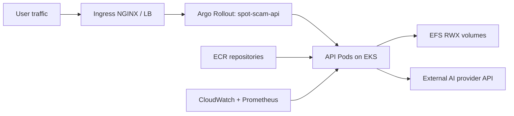
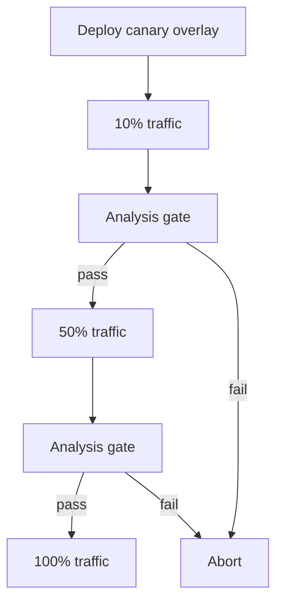

# AWS Deployment Pack

Production deployment guide for Spot the Scam on AWS using EKS, ECR, and EFS.

## Contents

- [1. AWS Architecture](#1-aws-architecture)
- [2. Deployment Assets in This Directory](#2-deployment-assets-in-this-directory)
- [3. Prerequisites](#3-prerequisites)
- [4. Terraform Provisioning](#4-terraform-provisioning)
- [5. Container Registry and Image Strategy](#5-container-registry-and-image-strategy)
- [6. Kubernetes Deployment Strategies](#6-kubernetes-deployment-strategies)
- [7. Runtime Secret Bootstrap](#7-runtime-secret-bootstrap)
- [8. End-to-End Runbook](#8-end-to-end-runbook)
- [9. Jenkins Integration](#9-jenkins-integration)
- [10. Argo CD GitOps (Optional)](#10-argo-cd-gitops-optional)
- [11. Security Hardening Checklist](#11-security-hardening-checklist)
- [12. Operations and Troubleshooting](#12-operations-and-troubleshooting)

## 1. AWS Architecture



## 2. Deployment Assets in This Directory

- `terraform/`: EKS, VPC, ECR, EFS, Helm add-ons, storage class.
- `k8s/canary/`: AWS provider canary overlay.
- `k8s/bluegreen/`: AWS provider blue/green overlay.

## 3. Prerequisites

- AWS account and production IAM boundaries.
- Tools: `aws`, `terraform`, `kubectl`, `kustomize`, `helm`, `argo-rollouts`, `docker`.
- IAM permissions for EKS, ECR, VPC, EFS, IAM role mapping, and S3 (if backend used).

Recommended production IAM split:

- Terraform provisioner role.
- CI image publisher role.
- Runtime cluster admin/operator role.

## 4. Terraform Provisioning

### 4.1 Initialize and validate

```bash
cd aws/terraform
terraform init
terraform validate
cp terraform.tfvars.example terraform.tfvars
```

### 4.2 Plan and apply

```bash
terraform plan -out tfplan
terraform apply tfplan
```

### 4.3 Configure kube context

```bash
terraform output -raw configure_kubectl
# run returned command
kubectl get nodes
```

### 4.4 Bootstrap cluster add-ons (ingress + Argo Rollouts)

```bash
# from repository root
./ops/ci/bootstrap_cluster_addons.sh
kubectl get crd rollouts.argoproj.io
```

### 4.5 Validate storage class

```bash
kubectl get storageclass efs-sc
```

## 5. Container Registry and Image Strategy

ECR repos are provisioned for API, frontend, and model images.

Login and push:

```bash
aws ecr get-login-password --region us-east-1 | docker login --username AWS --password-stdin <ACCOUNT>.dkr.ecr.us-east-1.amazonaws.com

docker build -t <ACCOUNT>.dkr.ecr.us-east-1.amazonaws.com/spot-scam-api:<TAG> .
docker push <ACCOUNT>.dkr.ecr.us-east-1.amazonaws.com/spot-scam-api:<TAG>

docker build -t <ACCOUNT>.dkr.ecr.us-east-1.amazonaws.com/spot-scam-frontend:<TAG> -f frontend/Dockerfile frontend
docker push <ACCOUNT>.dkr.ecr.us-east-1.amazonaws.com/spot-scam-frontend:<TAG>
```

Production image policy:

- Use immutable release tags and track digests.
- Keep previous stable tag live for immediate rollback.
- Block promotion on HIGH/CRITICAL vulnerabilities.

## 6. Kubernetes Deployment Strategies

### 6.1 Canary strategy



Deploy canary baseline:

```bash
./scripts/deploy_multi_cloud.sh --provider aws --strategy canary --namespace spot-scam
```

### 6.2 Blue/green strategy

Deploy blue/green baseline:

```bash
./scripts/deploy_multi_cloud.sh --provider aws --strategy bluegreen --namespace spot-scam
```

Patch runtime image:

```bash
kubectl -n spot-scam patch rollout spot-scam-api \
  --type='merge' \
  -p '{"spec":{"template":{"spec":{"containers":[{"name":"api","image":"<ACCOUNT>.dkr.ecr.us-east-1.amazonaws.com/spot-scam-api:<TAG>"}]}}}}'
```

## 7. Runtime Secret Bootstrap

Create runtime secret before first deployment:

```bash
kubectl -n spot-scam create secret generic spot-scam-api-secrets \
  --from-literal=GEMINI_API_KEY='<real-key>' \
  --dry-run=client -o yaml | kubectl apply -f -
```

## 8. End-to-End Runbook

Before running deploy scripts, replace placeholder domains/registry values in this provider pack. Preflight checks will block deployment if placeholders remain.

1. Apply Terraform stack.
2. Configure kube context.
3. Push release images.
4. Deploy provider overlay.
5. Patch rollout image.
6. Observe canary/bluegreen progression.
7. Promote or abort.

Operational commands:

```bash
argo-rollouts get rollout spot-scam-api -n spot-scam
argo-rollouts promote spot-scam-api -n spot-scam
argo-rollouts abort spot-scam-api -n spot-scam
argo-rollouts undo spot-scam-api -n spot-scam
```

## 9. Jenkins Integration

This pack is fully integrated with root `Jenkinsfile`:

- Set `PROVIDER=aws`
- Set `STRATEGY=canary` or `bluegreen`
- Set `API_IMAGE_REPO=<ACCOUNT>.dkr.ecr.us-east-1.amazonaws.com/spot-scam-api`

Credentials expected by Jenkins for AWS runs:

- `spot-scam-aws-credentials` (username/password = access key/secret)

## 10. Argo CD GitOps (Optional)

Bootstrap Argo CD and create an AWS staging/prod app:

```bash
./ops/ci/bootstrap_argocd.sh \
  --env staging \
  --provider aws \
  --repo-url https://github.com/<org>/<repo>.git \
  --revision main
```

Sync and wait:

```bash
./ops/ci/argocd_sync_wait.sh --app spot-scam-staging-aws --timeout-sec 900
```

## 11. Security Hardening Checklist

- Enforce IAM least privilege for Terraform and CI users.
- Require private ECR pull from cluster nodes only.
- Keep EFS encrypted and access-scoped via security groups.
- Use ACM-managed certs with automatic rotation.
- Keep Kubernetes secrets synced from AWS Secrets Manager.

## 12. Operations and Troubleshooting

Useful checks:

```bash
kubectl get pods -n spot-scam
kubectl get pvc -n spot-scam
kubectl describe rollout spot-scam-api -n spot-scam
kubectl logs -l app=spot-scam-api -n spot-scam --tail=200
```

Common AWS-specific failures:

- `ImagePullBackOff`: ECR auth/permissions issue.
- `Pending PVC`: EFS CSI driver not installed or `efs-sc` missing.
- No external ingress: ingress controller service not provisioned with external LB.
