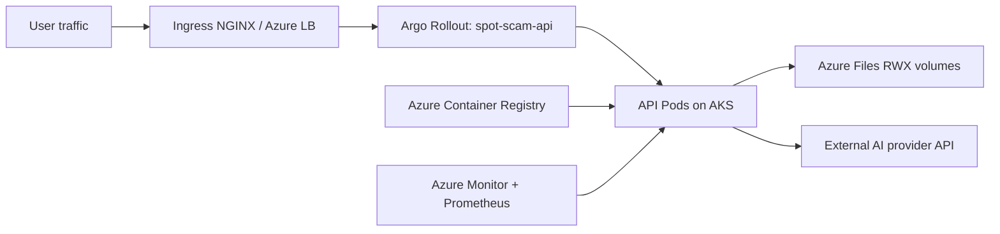
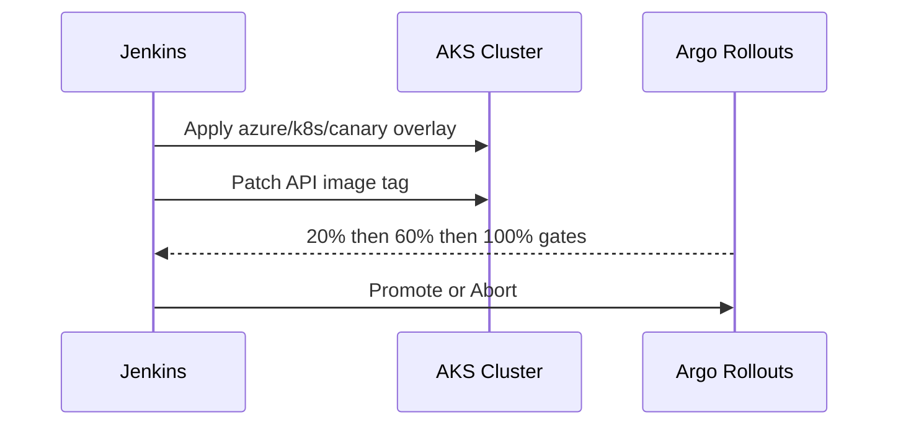

# Azure Deployment Pack

Production deployment guide for Spot the Scam on Azure using AKS, ACR, and Azure Files.

## Contents

- [1. Azure Architecture](#1-azure-architecture)
- [2. Deployment Assets in This Directory](#2-deployment-assets-in-this-directory)
- [3. Prerequisites](#3-prerequisites)
- [4. Terraform Provisioning](#4-terraform-provisioning)
- [5. Container Registry and Image Strategy](#5-container-registry-and-image-strategy)
- [6. Kubernetes Deployment Strategies](#6-kubernetes-deployment-strategies)
- [7. Runtime Secret Bootstrap](#7-runtime-secret-bootstrap)
- [8. End-to-End Runbook](#8-end-to-end-runbook)
- [9. Jenkins Integration](#9-jenkins-integration)
- [10. Argo CD GitOps (Optional)](#10-argo-cd-gitops-optional)
- [11. Security Hardening Checklist](#11-security-hardening-checklist)
- [12. Operations and Troubleshooting](#12-operations-and-troubleshooting)

## 1. Azure Architecture



## 2. Deployment Assets in This Directory

- `terraform/`: AKS, VNet/subnet, ACR, storage account/share, Helm add-ons.
- `k8s/canary/`: Azure provider canary overlay.
- `k8s/bluegreen/`: Azure provider blue/green overlay.

## 3. Prerequisites

- Azure subscription and resource governance controls.
- Tools: `az`, `terraform`, `kubectl`, `kustomize`, `helm`, `argo-rollouts`, `docker`.
- Permissions for AKS, ACR, networking, and storage resources.

## 4. Terraform Provisioning

```bash
cd azure/terraform
terraform init
terraform validate
cp terraform.tfvars.example terraform.tfvars
terraform plan -out tfplan
terraform apply tfplan
```

Configure kube context:

```bash
terraform output -raw configure_kubectl
# run returned command
kubectl get nodes
kubectl get storageclass azurefile-rwx
```

Bootstrap required add-ons:

```bash
# from repository root
./ops/ci/bootstrap_cluster_addons.sh
kubectl get crd rollouts.argoproj.io
```

## 5. Container Registry and Image Strategy

```bash
az acr login --name <ACR_NAME>

docker build -t <ACR_LOGIN_SERVER>/spot-scam-api:<TAG> .
docker push <ACR_LOGIN_SERVER>/spot-scam-api:<TAG>

docker build -t <ACR_LOGIN_SERVER>/spot-scam-frontend:<TAG> -f frontend/Dockerfile frontend
docker push <ACR_LOGIN_SERVER>/spot-scam-frontend:<TAG>
```

Production image policy:

- Immutable release tags.
- Enforced image scanning gates.
- Digest-based promotion records.

## 6. Kubernetes Deployment Strategies

### 6.1 Canary rollout



```bash
./scripts/deploy_multi_cloud.sh --provider azure --strategy canary --namespace spot-scam
```

### 6.2 Blue/green rollout

```bash
./scripts/deploy_multi_cloud.sh --provider azure --strategy bluegreen --namespace spot-scam
```

Patch runtime image:

```bash
kubectl -n spot-scam patch rollout spot-scam-api \
  --type='merge' \
  -p '{"spec":{"template":{"spec":{"containers":[{"name":"api","image":"<ACR_LOGIN_SERVER>/spot-scam-api:<TAG>"}]}}}}'
```

## 7. Runtime Secret Bootstrap

Create runtime secret before first deployment:

```bash
kubectl -n spot-scam create secret generic spot-scam-api-secrets \
  --from-literal=GEMINI_API_KEY='<real-key>' \
  --dry-run=client -o yaml | kubectl apply -f -
```

## 8. End-to-End Runbook

Before running deploy scripts, replace placeholder domains/registry values in this provider pack. Preflight checks will block deployment if placeholders remain.

1. Apply Terraform stack.
2. Configure kube context and verify `azurefile-rwx`.
3. Push release images to ACR.
4. Deploy overlay and patch image tag.
5. Observe rollout and promote/abort.

```bash
argo-rollouts get rollout spot-scam-api -n spot-scam
argo-rollouts promote spot-scam-api -n spot-scam
argo-rollouts abort spot-scam-api -n spot-scam
argo-rollouts undo spot-scam-api -n spot-scam
```

## 9. Jenkins Integration

Root `Jenkinsfile` supports this provider directly:

- Set `PROVIDER=azure`
- Set `API_IMAGE_REPO=<ACR_LOGIN_SERVER>/spot-scam-api`
- Select `STRATEGY=canary` or `bluegreen`

Credentials expected by Jenkins for Azure runs:

- `spot-scam-azure-sp` (username/password = client id/client secret)
- `spot-scam-azure-tenant` (secret text)
- `spot-scam-azure-subscription` (secret text)

## 10. Argo CD GitOps (Optional)

Bootstrap Argo CD and create an Azure staging/prod app:

```bash
./ops/ci/bootstrap_argocd.sh \
  --env staging \
  --provider azure \
  --repo-url https://github.com/<org>/<repo>.git \
  --revision main
```

Sync and wait:

```bash
./ops/ci/argocd_sync_wait.sh --app spot-scam-staging-azure --timeout-sec 900
```

## 11. Security Hardening Checklist

- Use managed identities for workload access.
- Scope ACR pull rights to AKS kubelet identity only.
- Keep storage accounts private and TLS enforced.
- Store secrets in Azure Key Vault with sync into Kubernetes.
- Restrict inbound network exposure through approved ingress paths.

## 12. Operations and Troubleshooting

```bash
kubectl get pods -n spot-scam
kubectl get pvc -n spot-scam
kubectl describe rollout spot-scam-api -n spot-scam
kubectl logs -l app=spot-scam-api -n spot-scam --tail=200
```

Common Azure-specific failures:

- `ImagePullBackOff`: missing `AcrPull` binding.
- `Pending PVC`: `azurefile-rwx` class unavailable or CSI issue.
- Ingress endpoint missing: Azure LB provisioning delay or subnet policy issue.
