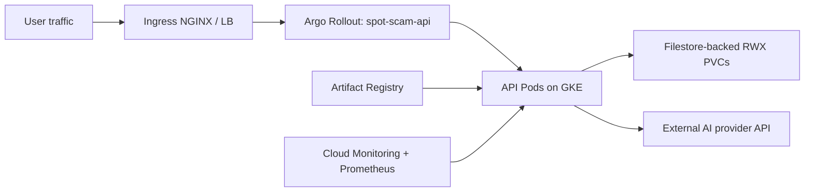
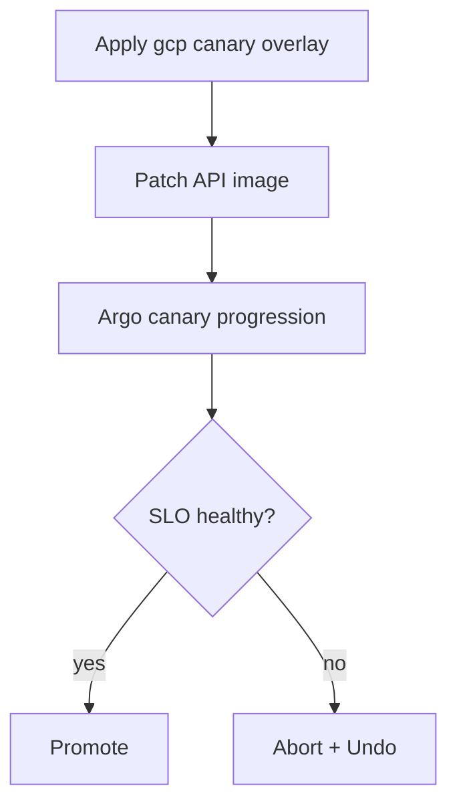

# GCP Deployment Pack

Production deployment guide for Spot the Scam on Google Cloud using GKE, Artifact Registry, and Filestore.

## Contents

- [1. GCP Architecture](#1-gcp-architecture)
- [2. Deployment Assets in This Directory](#2-deployment-assets-in-this-directory)
- [3. Prerequisites](#3-prerequisites)
- [4. Terraform Provisioning](#4-terraform-provisioning)
- [5. Container Registry and Image Strategy](#5-container-registry-and-image-strategy)
- [6. Kubernetes Deployment Strategies](#6-kubernetes-deployment-strategies)
- [7. Runtime Secret Bootstrap](#7-runtime-secret-bootstrap)
- [8. End-to-End Runbook](#8-end-to-end-runbook)
- [9. Jenkins Integration](#9-jenkins-integration)
- [10. Argo CD GitOps (Optional)](#10-argo-cd-gitops-optional)
- [11. Security Hardening Checklist](#11-security-hardening-checklist)
- [12. Operations and Troubleshooting](#12-operations-and-troubleshooting)

## 1. GCP Architecture



## 2. Deployment Assets in This Directory

- `terraform/`: GKE, VPC/subnetwork, Artifact Registry, Filestore, Helm add-ons.
- `k8s/canary/`: GCP provider canary overlay.
- `k8s/bluegreen/`: GCP provider blue/green overlay.

## 3. Prerequisites

- GCP project with billing and required APIs enabled.
- Tools: `gcloud`, `terraform`, `kubectl`, `kustomize`, `helm`, `argo-rollouts`, `docker`.
- IAM rights for GKE, network, Artifact Registry, Filestore, and service account usage.

## 4. Terraform Provisioning

```bash
cd gcp/terraform
terraform init
terraform validate
cp terraform.tfvars.example terraform.tfvars
terraform plan -out tfplan
terraform apply tfplan
```

Configure kube context:

```bash
terraform output -raw configure_kubectl
# run returned command
kubectl get nodes
kubectl get storageclass filestore-rwx
```

Bootstrap required add-ons:

```bash
# from repository root
./ops/ci/bootstrap_cluster_addons.sh
kubectl get crd rollouts.argoproj.io
```

## 5. Container Registry and Image Strategy

```bash
gcloud auth configure-docker us-central1-docker.pkg.dev --quiet

docker build -t us-central1-docker.pkg.dev/<PROJECT_ID>/spot-scam/spot-scam-api:<TAG> .
docker push us-central1-docker.pkg.dev/<PROJECT_ID>/spot-scam/spot-scam-api:<TAG>

docker build -t us-central1-docker.pkg.dev/<PROJECT_ID>/spot-scam/spot-scam-frontend:<TAG> -f frontend/Dockerfile frontend
docker push us-central1-docker.pkg.dev/<PROJECT_ID>/spot-scam/spot-scam-frontend:<TAG>
```

## 6. Kubernetes Deployment Strategies

### 6.1 Canary rollout



```bash
./scripts/deploy_multi_cloud.sh --provider gcp --strategy canary --namespace spot-scam
```

### 6.2 Blue/green rollout

```bash
./scripts/deploy_multi_cloud.sh --provider gcp --strategy bluegreen --namespace spot-scam
```

Patch runtime image:

```bash
kubectl -n spot-scam patch rollout spot-scam-api \
  --type='merge' \
  -p '{"spec":{"template":{"spec":{"containers":[{"name":"api","image":"us-central1-docker.pkg.dev/<PROJECT_ID>/spot-scam/spot-scam-api:<TAG>"}]}}}}'
```

## 7. Runtime Secret Bootstrap

Create runtime secret before first deployment:

```bash
kubectl -n spot-scam create secret generic spot-scam-api-secrets \
  --from-literal=GEMINI_API_KEY='<real-key>' \
  --dry-run=client -o yaml | kubectl apply -f -
```

## 8. End-to-End Runbook

Before running deploy scripts, replace placeholder domains/registry values in this provider pack. Preflight checks will block deployment if placeholders remain.

1. Apply Terraform stack.
2. Configure kube context and verify Filestore storage class.
3. Push release images.
4. Deploy selected strategy overlay.
5. Patch API release tag.
6. Observe and control rollout progression.

```bash
argo-rollouts get rollout spot-scam-api -n spot-scam
argo-rollouts promote spot-scam-api -n spot-scam
argo-rollouts abort spot-scam-api -n spot-scam
argo-rollouts undo spot-scam-api -n spot-scam
```

## 9. Jenkins Integration

Root `Jenkinsfile` supports this provider directly:

- Set `PROVIDER=gcp`
- Set `API_IMAGE_REPO=us-central1-docker.pkg.dev/<PROJECT_ID>/spot-scam/spot-scam-api`
- Set `GCP_PROJECT_ID` pipeline parameter

Credentials expected by Jenkins for GCP runs:

- `spot-scam-gcp-sa` (file credential, service account key JSON)

## 10. Argo CD GitOps (Optional)

Bootstrap Argo CD and create a GCP staging/prod app:

```bash
./ops/ci/bootstrap_argocd.sh \
  --env staging \
  --provider gcp \
  --repo-url https://github.com/<org>/<repo>.git \
  --revision main
```

Sync and wait:

```bash
./ops/ci/argocd_sync_wait.sh --app spot-scam-staging-gcp --timeout-sec 900
```

## 11. Security Hardening Checklist

- Use least-privileged service accounts and Workload Identity.
- Keep Artifact Registry private and scoped.
- Enforce Binary Authorization / image attestations where required.
- Keep Filestore and network ranges private.
- Store runtime secrets in Secret Manager and sync to Kubernetes.

## 12. Operations and Troubleshooting

```bash
kubectl get pods -n spot-scam
kubectl get pvc -n spot-scam
kubectl describe rollout spot-scam-api -n spot-scam
kubectl logs -l app=spot-scam-api -n spot-scam --tail=200
```

Common GCP-specific failures:

- `ImagePullBackOff`: Artifact Registry permissions or auth helper mismatch.
- `Pending PVC`: Filestore CSI not present or invalid class parameters.
- `403` API errors from pipeline: service account missing required IAM roles.
