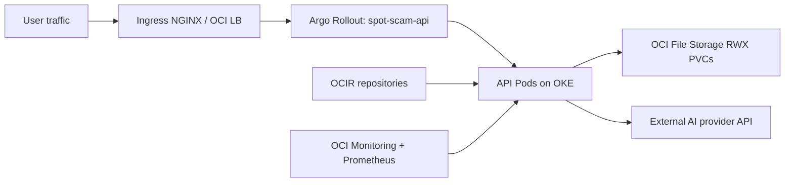
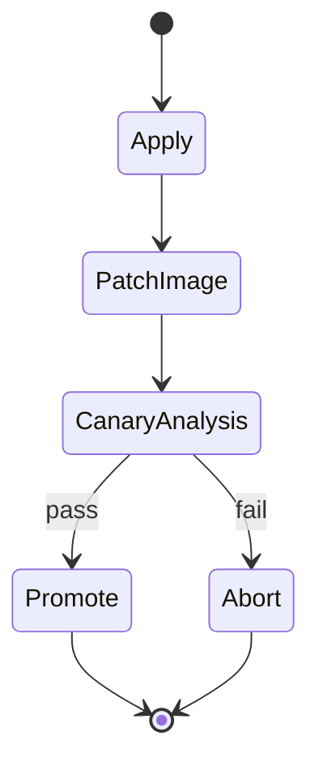

# OCI Deployment Pack

Production deployment guide for Spot the Scam on Oracle Cloud Infrastructure using OKE, OCIR, and OCI File Storage.

## Contents

- [1. OCI Architecture](#1-oci-architecture)
- [2. Deployment Assets in This Directory](#2-deployment-assets-in-this-directory)
- [3. Prerequisites](#3-prerequisites)
- [4. Terraform Provisioning](#4-terraform-provisioning)
- [5. Container Registry and Image Strategy](#5-container-registry-and-image-strategy)
- [6. Kubernetes Deployment Strategies](#6-kubernetes-deployment-strategies)
- [7. Runtime Secret Bootstrap](#7-runtime-secret-bootstrap)
- [8. End-to-End Runbook](#8-end-to-end-runbook)
- [9. Jenkins Integration](#9-jenkins-integration)
- [10. Argo CD GitOps (Optional)](#10-argo-cd-gitops-optional)
- [11. Security Hardening Checklist](#11-security-hardening-checklist)
- [12. Operations and Troubleshooting](#12-operations-and-troubleshooting)

## 1. OCI Architecture



## 2. Deployment Assets in This Directory

- `terraform/`: OKE, networking, OCIR repositories, object storage, file storage.
- `k8s/canary/`: OCI provider canary overlay.
- `k8s/bluegreen/`: OCI provider blue/green overlay.

## 3. Prerequisites

- OCI tenancy and compartment with production governance controls.
- Tools: `oci`, `terraform`, `kubectl`, `kustomize`, `helm`, `argo-rollouts`, `docker`.
- API key auth configured for CLI and Terraform.

## 4. Terraform Provisioning

```bash
cd oci/terraform
terraform init
terraform validate
cp terraform.tfvars.example terraform.tfvars
terraform plan -out tfplan
terraform apply tfplan
```

Configure kube context:

```bash
terraform output -raw configure_kubectl
# run returned command
kubectl get nodes
```

Bootstrap required add-ons:

```bash
# from repository root
./ops/ci/bootstrap_cluster_addons.sh
kubectl get crd rollouts.argoproj.io
```

Validate file storage class presence (`oci-fss`) in-cluster.

## 5. Container Registry and Image Strategy

```bash
docker login iad.ocir.io

docker build -t iad.ocir.io/<TENANCY_NAMESPACE>/spot-scam-api:<TAG> .
docker push iad.ocir.io/<TENANCY_NAMESPACE>/spot-scam-api:<TAG>

docker build -t iad.ocir.io/<TENANCY_NAMESPACE>/spot-scam-frontend:<TAG> -f frontend/Dockerfile frontend
docker push iad.ocir.io/<TENANCY_NAMESPACE>/spot-scam-frontend:<TAG>
```

## 6. Kubernetes Deployment Strategies

### 6.1 Canary rollout



```bash
./scripts/deploy_multi_cloud.sh --provider oci --strategy canary --namespace spot-scam
```

### 6.2 Blue/green rollout

```bash
./scripts/deploy_multi_cloud.sh --provider oci --strategy bluegreen --namespace spot-scam
```

Patch runtime image:

```bash
kubectl -n spot-scam patch rollout spot-scam-api \
  --type='merge' \
  -p '{"spec":{"template":{"spec":{"containers":[{"name":"api","image":"iad.ocir.io/<TENANCY_NAMESPACE>/spot-scam-api:<TAG>"}]}}}}'
```

## 7. Runtime Secret Bootstrap

Create runtime secret before first deployment:

```bash
kubectl -n spot-scam create secret generic spot-scam-api-secrets \
  --from-literal=GEMINI_API_KEY='<real-key>' \
  --dry-run=client -o yaml | kubectl apply -f -
```

## 8. End-to-End Runbook

Before running deploy scripts, replace placeholder domains/registry values in this provider pack. Preflight checks will block deployment if placeholders remain.

1. Apply Terraform stack.
2. Configure kube context.
3. Push release images to OCIR.
4. Deploy overlay for selected strategy.
5. Patch API image to release tag.
6. Promote/abort based on live telemetry.

```bash
argo-rollouts get rollout spot-scam-api -n spot-scam
argo-rollouts promote spot-scam-api -n spot-scam
argo-rollouts abort spot-scam-api -n spot-scam
argo-rollouts undo spot-scam-api -n spot-scam
```

## 9. Jenkins Integration

Root `Jenkinsfile` supports this provider directly:

- Set `PROVIDER=oci`
- Set `API_IMAGE_REPO=iad.ocir.io/<TENANCY_NAMESPACE>/spot-scam-api`

Credentials expected by Jenkins for OCI runs:

- `spot-scam-oci-config` (file credential, OCI CLI config)
- `spot-scam-ocir` (username/password for OCIR)

## 10. Argo CD GitOps (Optional)

Bootstrap Argo CD and create an OCI staging/prod app:

```bash
./ops/ci/bootstrap_argocd.sh \
  --env staging \
  --provider oci \
  --repo-url https://github.com/<org>/<repo>.git \
  --revision main
```

Sync and wait:

```bash
./ops/ci/argocd_sync_wait.sh --app spot-scam-staging-oci --timeout-sec 900
```

## 11. Security Hardening Checklist

- Use compartment-level IAM least privilege.
- Keep OCIR repositories private and controlled.
- Use Vault/secret manager integration for app secrets.
- Restrict network paths between OKE and storage endpoints.
- Enable audit log export and retention policy.

## 12. Operations and Troubleshooting

```bash
kubectl get pods -n spot-scam
kubectl get pvc -n spot-scam
kubectl describe rollout spot-scam-api -n spot-scam
kubectl logs -l app=spot-scam-api -n spot-scam --tail=200
```

Common OCI-specific failures:

- `ImagePullBackOff`: OCIR auth mismatch.
- `Pending PVC`: missing/incorrect `oci-fss` storage class or CSI binding.
- Ingress not reachable: LB subnet/network route misconfiguration.
