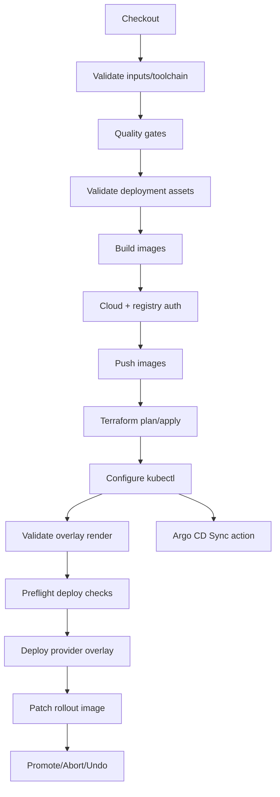

# Jenkins CI/CD Configuration

This directory documents the production Jenkins configuration used by the root `Jenkinsfile`.

## Pipeline Summary

The pipeline supports:

- Multi-cloud deployment (`aws`, `azure`, `gcp`, `oci`).
- Progressive deployment strategy selection (`canary`, `bluegreen`).
- Optional Argo CD app synchronization (`argocd_sync` action).
- Quality gates for Python and frontend code.
- Container build and push.
- Terraform plan/apply.
- Rollout operations: deploy, promote, abort, undo.
- Namespace is currently fixed to `spot-scam` to match checked-in kustomizations.
- Deployment asset validation via `ops/ci/validate_deployment_assets.sh`.
- Runtime preflight checks via `ops/ci/preflight_deploy_checks.sh`.

Key deploy safeguards:

- If `RUN_IMAGE_BUILD_PUSH=false`, `IMAGE_TAG` must be explicitly provided.
- `KUBECONFIG_COMMAND` can be supplied to configure cluster context when Terraform apply is skipped.
- Deploys are blocked if placeholder domains/values remain in rendered manifests.
- Deploys are blocked when `spot-scam-api-secrets` or `GEMINI_API_KEY` is missing in the target namespace.
- Deploys are blocked when Argo Rollouts CRD is missing; bootstrap with `ops/ci/bootstrap_cluster_addons.sh`.

## Jenkins Credentials

Create these credentials in Jenkins:

- `spot-scam-aws-credentials` (`usernamePassword`): `AWS_ACCESS_KEY_ID` / `AWS_SECRET_ACCESS_KEY`
- `spot-scam-azure-sp` (`usernamePassword`): `AZURE_CLIENT_ID` / `AZURE_CLIENT_SECRET`
- `spot-scam-azure-tenant` (`secret text`): Azure tenant id
- `spot-scam-azure-subscription` (`secret text`): Azure subscription id
- `spot-scam-gcp-sa` (`secret file`): GCP service account JSON
- `spot-scam-oci-config` (`secret file`): OCI CLI config file
- `spot-scam-ocir` (`usernamePassword`): OCIR username/password token

## Required Jenkins Agent Tooling

Build agents that run this pipeline should have:

- `python3`, `node`, `npm`
- `docker`
- `terraform`
- `kubectl`, `kustomize`, `helm`
- `argo-rollouts`
- `argocd` (required when using `ACTION=argocd_sync`)
- Provider CLIs (`aws`, `az`, `gcloud`, `oci`)

Action-path note:

- `argocd_sync` requires `argocd` CLI and Argo CD authentication.
- `deploy|promote|abort|undo` require Kubernetes access (`kubectl`, and `argo-rollouts` for rollout control actions).

## Recommended Jenkins Job Settings

- Pipeline from SCM with branch protections.
- Concurrency disabled (already enforced in pipeline options).
- Build retention aligned with compliance policy.
- Protected manual input steps for production applies.
- Ensure Jenkins agents are already authenticated to Argo CD before running `ACTION=argocd_sync`.

## Security Notes

- Do not store cloud credentials in repository files.
- Keep Jenkins credentials scoped to job/folder with least privilege.
- Enable audit logging for credential usage and deploy actions.
- Restrict who can run `promote`, `abort`, `undo`, and `argocd_sync` actions.
